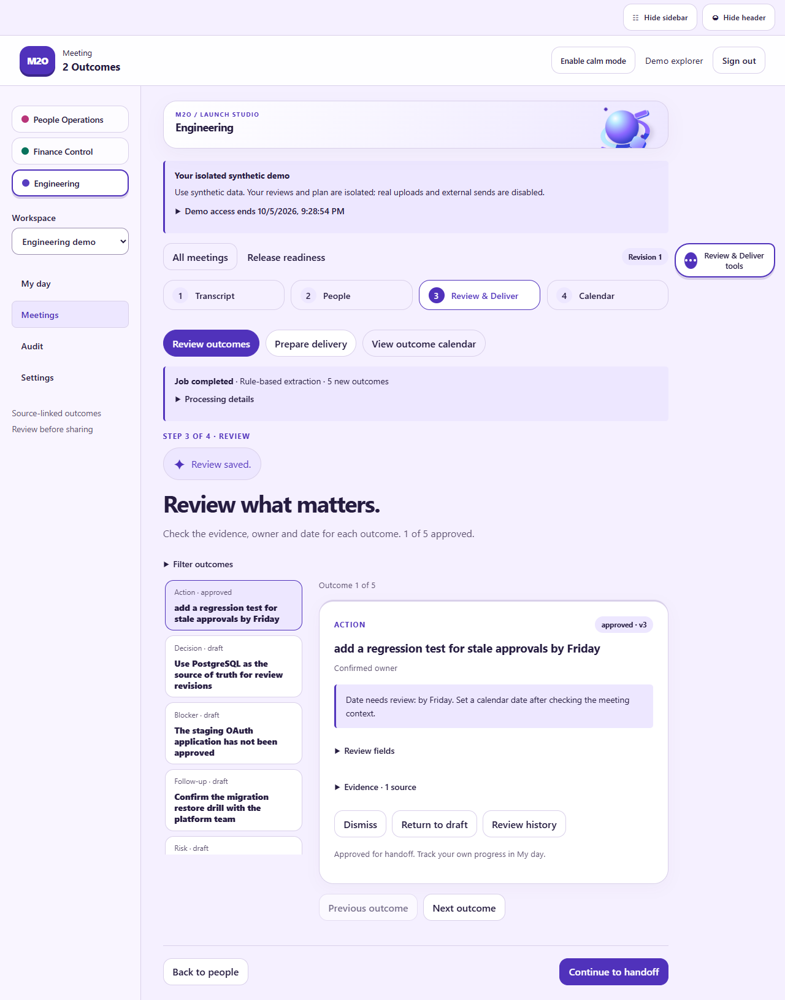
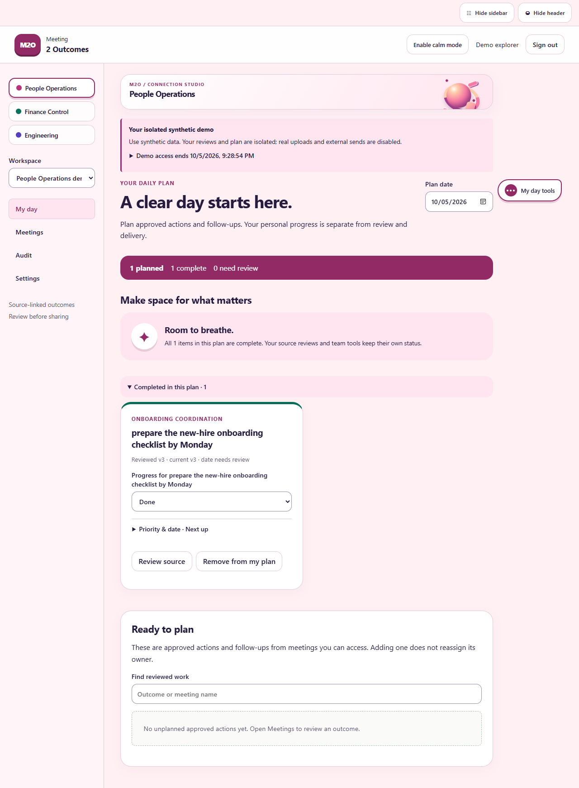
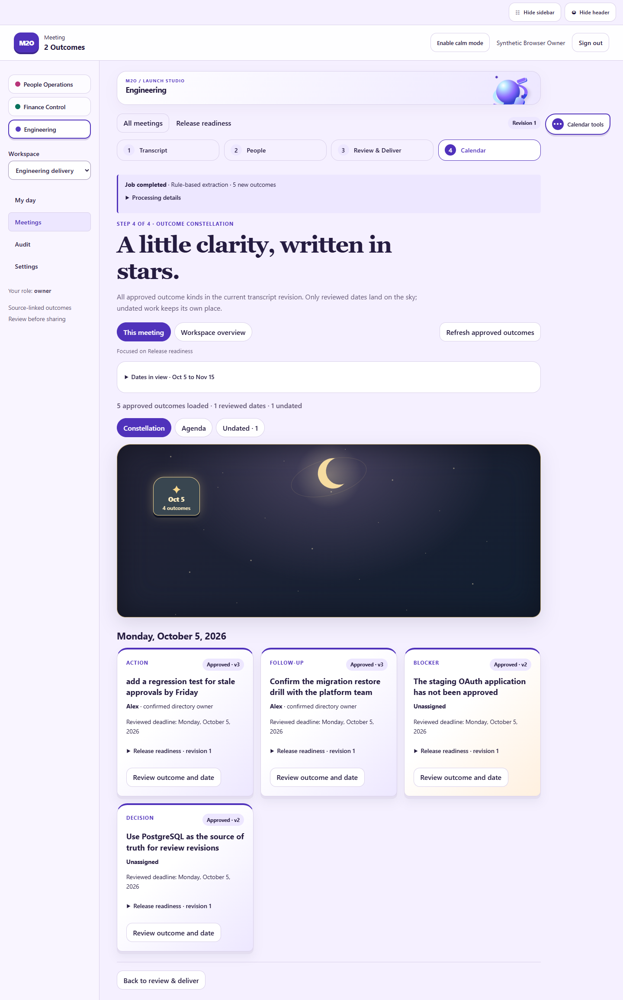
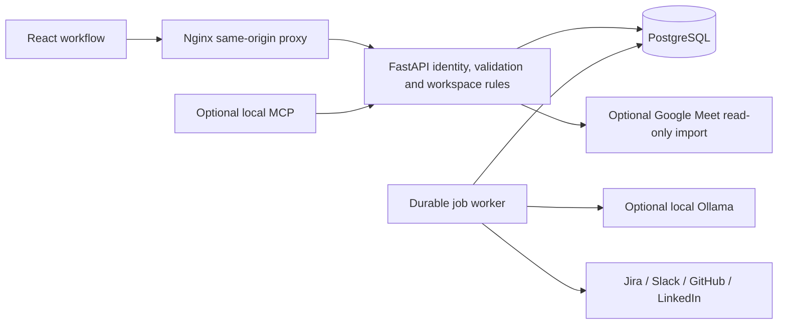
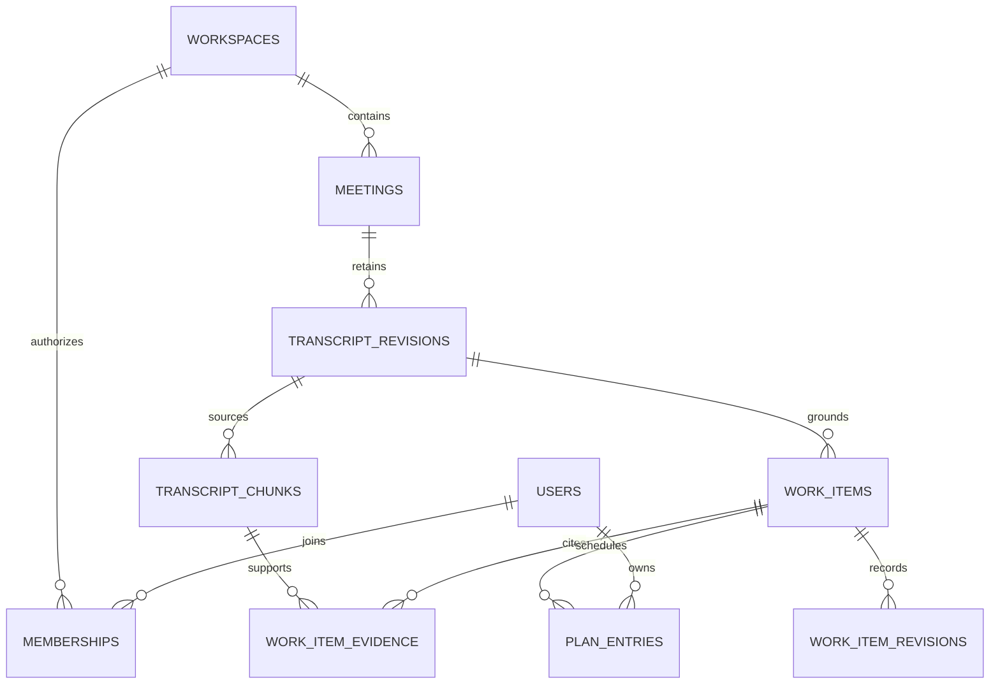

# M2O · Meeting 2 Outcomes

**Leave the meeting with a clear next step.**

M2O turns meeting transcripts into source-linked actions, decisions, blockers, follow-ups and risks. Confirm the people involved, review what matters, build a daily plan, and prepare an exact handoff to your team's tools.

Built with **React + TypeScript, FastAPI, PostgreSQL and optional local Ollama inference**. Three department experiences make the same workflow useful for Engineering, People Operations and Finance Control.


*An original department motion scene used in the interface. [Play the engineering loop](frontend/public/scenes/engineering.mp4) · [People Operations](frontend/public/scenes/hr.mp4) · [Finance Control](frontend/public/scenes/finance.mp4). Calm mode and system reduced motion keep the workflow comfortable.*

<details>
<summary>See the real workflow: reviewed outcomes and a finished daily plan</summary>

| Engineering review | People Operations daily plan |
| --- | --- |
| [](docs/media/visitor-engineering-review.png) | [](docs/media/visitor-hr-my-day.png) |

These are actual browser captures from isolated synthetic workspaces, using the real API and PostgreSQL worker. Review approval and personal completion remain separate. [Mobile people confirmation](docs/media/visitor-mobile-people.png).

</details>

<details>
<summary>See the four-stage workspace and outcome constellation</summary>

[](docs/media/v2-calendar-desktop.png)

Real browser captures from a disposable PostgreSQL workspace: [mobile calendar](docs/media/v2-calendar-mobile.png), [mobile settings in calm mode](docs/media/v2-settings-mobile-calm.png), and [meeting search with distinct same-title records](docs/media/v2-meeting-search-desktop.png). These use synthetic people and outcomes, not private meeting data.

</details>

## What you can do

### From meeting-to-tasks to M2O

The original committed application focused on transcript-grounded task drafts and optional GitHub issues. M2O expands that foundation into a workspace product while keeping human review and local inference boundaries explicit.

| Area | Original meeting-to-tasks | Revamped M2O |
| --- | --- | --- |
| Product scope | Transcript → task drafts → optional GitHub issues | Transcript → confirmed people → reviewed outcomes → optional delivery → calendar and personal plan |
| Users and access | Local meeting workspace and demo controls | Authenticated workspace roles, isolated synthetic visitors, invitations, recovery and scoped privacy controls |
| Persistence | SQLite meetings, chunks, drafts and publication history | PostgreSQL relations, additive Alembic migrations, immutable transcript/review revisions and database-backed jobs |
| Extraction | Local Ollama candidates with a narrow explicit-action fallback | Five outcome kinds, bounded source batches, runtime validation, exact evidence links, explicit-label preservation and reported extraction mode |
| Interface | Responsive meeting workspace | Four addressable stages, department themes, contextual tools, collapsible chrome, calm mode and mobile calendar/agenda |
| Integrations | GitHub issue preview and creation | Jira, Slack and GitHub reviewed delivery; supported LinkedIn profile/publishing APIs; configurable Google Meet source import. Live activation and the LinkedIn publishing interface have separate remaining gates. |
| Reliability | Persisted drafts and publication history | Expected-version checks, exact payload approvals, durable delivery receipts, concurrency guards and explicit uncertain-write handling |
| Getting started | Separate native backend/frontend setup and optional model configuration | Two-command Docker setup for a synthetic demo; provider accounts and model downloads optional |

This comparison describes source capabilities, not a claim of deployed production use. Current verification and remaining limits are recorded in [VALIDATION.md](docs/VALIDATION.md).

### A meeting in four stages

| Step | What happens |
| --- | --- |
| **1 · Transcript** | Paste or upload a UTF-8 transcript in a private workspace, or explore an isolated synthetic demo. Optional Google Meet import reads an existing latest transcript after operator setup and user authorization. |
| **2 · People** | Resolve ambiguous names against the workspace directory. A suggested match becomes context only after confirmation. |
| **3 · Review & Deliver** | Inspect source-linked outcomes, approve their current versions, then choose a destination and inspect its exact preview. Review approval and delivery approval remain separate actions. |
| **4 · Calendar** | Explore all approved outcomes in a celestial calendar or accessible agenda. Reviewed dates determine placement; undated work remains visible and confirmed owners appear by name. |

The four main destinations are **My day, Meetings, Audit and Settings**. Settings groups People, Connections, Privacy & data, Access and Motion. The header and sidebar can collapse and reopen. **My day** owns your personal priorities and progress; it does not change review approval or external issue status.

[Google Meet setup and limits](docs/GOOGLE_MEET_IMPORT.md): importing requires an OAuth app and a transcript Google already generated. The importer does not record meetings or create transcription, and never substitutes an older meeting silently.

| Department | Example use case |
| --- | --- |
| **People Operations** | Make onboarding and training handoffs explicit: who owns equipment, which prerequisite is blocked, and what needs a follow-up. |
| **Finance Control** | Turn close/reconciliation conversations into traceable tasks, decisions and unresolved approval risks. Outcomes do not execute payments or replace financial approval. |
| **Engineering** | Connect release decisions, regression work and deployment blockers to reviewed tasks in the team's issue tools. |

Departments share the same evidence, permission and review rules. Their synthetic examples and visual identities emphasize different working contexts; selecting a theme does not grant access or silently change provider ownership.

## Try it locally

You need **Docker with Compose** and **Python 3.13**. Node is only needed for native frontend development. Provider accounts and AI downloads are optional.

From a fresh checkout, run:

```powershell
python scripts/configure_local.py
docker compose up -d --build web worker
```

Open **[localhost:8080](http://localhost:8080)** and choose the synthetic demo. Each visitor gets isolated department workspaces; no shared demo password or provider credentials are needed. Choose a department example, extract outcomes, review an action and add it to My Day.

The configuration helper creates ignored environment files with random local database credentials. It preserves existing configuration: if the files already exist, skip that first command. Compose runs migrations and starts the API, worker, database and frontend.

To check startup or stop the app:

```powershell
docker compose ps
docker compose logs --tail 40 api worker
docker compose stop
```

`stop` retains your local database volume. Avoid `down -v` unless you intentionally want to delete local data.

### Private workspaces

Create your own local owner account:

```powershell
docker compose exec api python -m scripts.bootstrap --email owner@example.test --name "Local Owner"
```

The command prompts privately for a password of at least 12 characters. Sign in to create private meetings. Owners invite collaborators through expiring links that they share themselves; recovery uses an operator-assisted local flow. See [user lifecycle and privacy](docs/USER_LIFECYCLE.md) for invitations, access, export, erasure and retention.

Local setup defaults to blocked external delivery. Enable private provider access deliberately using the integration guides below; signing in alone never publishes anything.

## Team-tool connections

| Destination | M2O capability | Setup |
| --- | --- | --- |
| **Local handoff** | Download reviewed outcomes as Markdown or JSON. | No external account required. |
| **Jira** | Discover issue types/fields, preview exact create/update content, approve queued delivery and inspect receipts. | [Connection](docs/JIRA_CONNECTION.md) · [Delivery rules](docs/JIRA_DELIVERY.md) |
| **Slack** | Post or update M2O messages; explicitly authorized meeting actions use signed interaction requests. | [Delivery](docs/SLACK_DELIVERY.md) · [Actions and hosting limits](docs/SLACK_ACTIONS.md) |
| **GitHub** | Deliver reviewed issues to an allowed workspace destination; detect duplicates, content conflicts and uncertain writes. | [GitHub guide](docs/GITHUB_DELIVERY.md) |
| **LinkedIn** | Own-profile connection in the interface; source-linked post/outreach draft and separately authorized member-posting APIs. The dedicated draft/publishing interface is still pending. | [LinkedIn guide](docs/LINKEDIN_DELIVERY.md) |

The public synthetic demo cannot connect to or publish through these providers. Live activation requires your own approved apps, permissions and private credentials. LinkedIn does not provide arbitrary transcript-name lookup or automated lead messages through this integration. Local tests use controlled provider responses; they do not prove live delivery.

For a hosted private installation, the operator manages the M2O OAuth application; invited users authorize it through the provider's consent screen. They should not be asked to create individual Jira developer applications or hand over client secrets. Provider app distribution, verification, consent and privacy requirements must be checked before enabling real users: [Atlassian 3LO requirements](https://developer.atlassian.com/cloud/jira/platform/oauth-2-3lo-apps/) and [Google Meet authorization](https://developers.google.com/workspace/meet/api/guides/authenticate-authorize).

## Architecture



The API validates identity, workspace permissions and versions. The optional MCP adapter calls the same application services locally. PostgreSQL stores transcripts, evidence, review history, personal plans, connection grants and job/receipt state. A separate worker handles indexing, extraction and approved delivery. Provider adapters own external protocols; application services own product rules.

The interface uses addressable React pages with browser Back/Forward support. It is client-rendered. Review approval, personal completion and provider status have separate owners. An uncertain external write remains visible and is never blindly resent.

### How outcomes are generated

1. Save a bounded UTF-8 transcript. M2O records a source revision, chunks its text and queues indexing; a worker stores the retrieval representation.
2. Request extraction. The worker processes source chunks in bounded batches. The default demo uses deterministic explicit-label rules; configured private local inference can request structured output from Ollama.
3. Validate candidate kinds, fields and source references. Explicit labeled facts are retained; repeated candidates are consolidated within the extraction. The response reports its mode, warnings and coverage rather than hiding a fallback.
4. Persist drafts with evidence pointing to the source chunks. Confirm participant matches and review each outcome; a model suggestion is neither a confirmed owner nor an approved task.
5. Approved current-revision outcomes appear in Calendar. Personal execution belongs to My day. External delivery needs a separate exact preview and affirmative approval; a queued job is not a successful provider receipt.

The five outcome kinds are **action, decision, blocker, follow-up and risk**. Relative phrases such as “next Friday” remain hints until a reviewer supplies an explicit date. AI does not authorize provider writes, invent confirmed identities or control completion state.

### Data model at a glance



Composite foreign keys preserve workspace/source relationships. Version checks and immutable review records prevent a changed transcript or outcome from reusing an old approval. Provider grants, destinations, proposals, operations, jobs and audit events retain the integration/lifecycle state separately. See [the full architecture](docs/ARCHITECTURE.md) and [database models](backend/app/models.py).

### Addressable pages and handoff URLs

These are route shapes, not production addresses. Replace the angle-bracket identifiers with values returned by your installation.

| Page | Browser path |
| --- | --- |
| My day | `/workspaces/<workspace-id>/plan` |
| Meeting list | `/workspaces/<workspace-id>/meetings` |
| New transcript | `/workspaces/<workspace-id>/meetings/new/transcript` |
| People confirmation | `/workspaces/<workspace-id>/meetings/<meeting-id>/people` |
| Review | `/workspaces/<workspace-id>/meetings/<meeting-id>/review` |
| Selected outcome | `/workspaces/<workspace-id>/meetings/<meeting-id>/review?outcome=<outcome-id>` |
| Delivery subview of step 3 | `/workspaces/<workspace-id>/meetings/<meeting-id>/share?handoff=preview&provider=jira` |
| Calendar | `/workspaces/<workspace-id>/meetings/<meeting-id>/calendar` |
| Audit | `/workspaces/<workspace-id>/audit` |
| Settings | `/workspaces/<workspace-id>/settings/people` — also `connections`, `privacy`, `access`, `motion` |

Handoff stages are `choose`, `configure`, `preview` and `receipt`; destinations are `local`, `jira`, `slack`, `github` and `linkedin`, subject to actual implemented capability and account access. The browser never bypasses server authorization because a URL is known. API contracts use the separate `/api/workspaces/<workspace-id>/…` namespace: [API guide](docs/API.md), [Google import](docs/GOOGLE_MEET_IMPORT.md), and the provider guides above.

| Location | Responsibility |
| --- | --- |
| `frontend/src/` | Workflow pages, department scenes, forms and client state. |
| `backend/app/` | API, authorization, services, worker and provider adapters. |
| `backend/migrations/` | Reviewed forward database migrations. |
| `backend/tests/`, `frontend/e2e/` | Backend, PostgreSQL and browser checks. |
| `scripts/`, `backend/scripts/` | Local configuration and administration. |
| `integrations/` | Provider app configuration assets. |
| `docs/` | Architecture, contracts, setup, verification and runbooks. |

## Local AI and development

The default runs deterministic extraction with hash-based retrieval, so the first demo needs no model download. Private local use can enable Ollama; generated outcomes always require human review. The interface reports the actual extraction mode and coverage.

- [Enable local inference, develop natively and run checks](docs/LOCAL_DEVELOPMENT.md)
- [Architecture and data integrity](docs/ARCHITECTURE.md)
- [API contracts](docs/API.md)
- [Lifecycle acceptance evidence](docs/USER_LIFECYCLE_ACCEPTANCE.md)
- [Verification record and limitations](docs/VALIDATION.md)

## Hosting and maintenance

The Render configuration prepares a bounded **synthetic-only** demo. It is not a deployed service. Free hosting sleep, database lifetime and local inference constraints matter; durable private use needs an explicit persistence, backup and recovery plan.

Read [the hosted runtime](docs/HOSTED_DEMO_RUNTIME.md), [Render constraints](docs/RENDER_PLAN.md), [operations](docs/OPERATIONS.md) and [security boundaries](docs/SECURITY.md) before deploying. No build, local test or configuration file implies verified production behavior.
