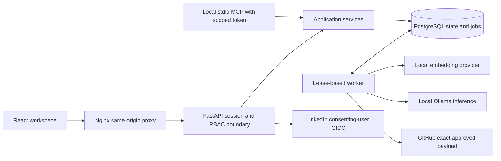

# Architecture and data integrity

## Provider connection increment — October 3

Jira now has a user-owned encrypted credential record and separate workspace destination bindings. Composite foreign keys enforce credential owner/membership alignment. The additive migration `20261003_03` adds three tables without replacing existing data. Account-level serialization prevents competing refresh token copies across workspaces; OAuth state is session-bound, expiring and one-time. The interface verifies a permitted site/project; exact issue create/update proposals now use their own persisted queue/receipt path documented in JIRA_DELIVERY.md. See [JIRA_CONNECTION.md](JIRA_CONNECTION.md). Older Jira-unavailable statements are superseded by the locally verified delivery increment; live provider activation remains unverified.

## Components and responsibilities

The API and worker are separate processes in one application, sharing typed SQLAlchemy models and service rules. They do not constitute independently owned microservices. PostgreSQL is the durable source of truth. The frontend owns transient form state; it never grants permission or decides which revision may be published.

Nginx serves compiled React assets and proxies same-origin API requests. React lazily loads the meeting workflow, participant directory, connections, and administration views. REST and MCP call the same meeting, retrieval, review, and publication services. The MCP adapter runs only over local stdio and requires a scoped token.

## Guided frontend and handoff boundary

The meeting workflow has four pages at `/workspaces/{workspace}/meetings/{meeting}/{transcript|people|review|share}`. The collection page lists saved meetings; `/meetings/new/transcript` creates one. Browser history is indexed so rejected Back/Forward navigation restores the original entry. Form state stays in React memory and prompts before leaving; saved transcript revisions, outcomes and identity confirmations stay in PostgreSQL. No transcript or credential is put in the URL or browser storage.

This is client-rendered page navigation, not SSR. Existing Nginx fallback and Vite development serving resolve deep links; refreshing a saved meeting reloads it through the authenticated API. Rendering strategy and page navigation are independent decisions. A real SSR migration would require a server renderer, authenticated request data, hydration and caching boundaries; those are not claimed here.

`Workbench` owns meeting requests, cancellation and job polling. `MeetingSteps` supplies focused transcript, people and single-outcome review views. `ShareStep` owns destination selection and artifact preparation. `services.delivery` supplies a workspace-authorized capability catalog and a provider-neutral, version-checked export. Jira readiness depends on the consenting owner and verified destination; Slack remains unavailable; no disconnected button can perform a fake external write. GitHub continues to use its persisted exact proposal/approval/worker path. LinkedIn remains an account-context integration, not a publication destination.

## Persistent data

| Relationship | Responsibility and enforced invariant |
| --- | --- |
| User → membership → workspace | Users can hold a different role in each workspace; membership keys are unique. |
| User → session/API token | Passwords use Argon2; stored session and token values are hashes, with expiration. API tokens have one workspace. |
| Workspace → meeting → transcript revision → chunks | A meeting slug is unique within its workspace. Revisions and chunk indices are unique within their parent. |
| Workspace → participant; revision → mention → participant | Directory context is explicit. Composite foreign keys prevent a confirmed participant from belonging to another workspace. |
| Meeting/revision → extraction run → outcomes | Outcomes belong to one transcript revision and use fingerprints to deduplicate extraction. |
| Outcome → evidence → chunk | Composite foreign keys require evidence to cite the same transcript revision as the outcome. |
| Outcome → review revision | Every saved version has an immutable payload snapshot and actor reference. |
| Meeting → publication proposal → operation → job | Exact issue payloads, selected versions, expiration, approval, unique operation key, and durable results preserve publication intent. |
| Workspace → audit event; OAuth state/profile; rate bucket | Records support bounded audit retrieval, one-time session-bound OAuth, minimal self profiles, and shared quotas. |

The initial migration defines 21 domain tables. SQL check constraints restrict roles, departments, outcome kinds and states, confidence range, and positive versions. Foreign keys cover scope and provenance; unique constraints prevent duplicate meetings, chunks, memberships, review versions, and operations. Indexes support workspace/meeting access, revision chunks, pending jobs, and audit chronology. These integrity checks also apply to code paths outside the HTTP adapter.

Vectors are bounded finite numeric arrays stored with their chunks. Each transcript revision stores its provider/model choice. A fresh worker or API process loads those same vectors, so restart does not silently change the retrieval representation. The lexical provider uses a normalized 384-dimensional signed hash representation. The optional semantic provider loads a locally cached Sentence Transformers model, with remote code and downloads disabled.

Retrieval filters by authorized workspace and meeting before loading vectors, then ranks the bounded current revision. Outcome lists batch evidence in one join after loading the outcomes; summary counts use one filtered SQL aggregation rather than loading the entire workspace into Python. This design favors explainable local behavior. It is not a database-wide approximate-nearest-neighbor index. At sustained volume, measure latency, memory, query count and corpus size before introducing pgvector or another index.

## Transcript → outcomes

1. An authenticated owner, reviewer, or editor submits a bounded UTF-8 transcript with meeting metadata.
2. The service locks an existing meeting and compares its expected version. A changed transcript creates a new immutable revision; an identical transcript preserves the current review.
3. The transaction stores speaker-aware Unicode-safe chunks and queues indexing. The API returns a job ID after commit.
4. A worker claims a job using PostgreSQL `FOR UPDATE SKIP LOCKED`, sets a 90-second lease, and commits.
5. Embeddings and inference run outside the database transaction. A heartbeat renews ownership every 20 seconds.
6. Extraction covers the entire revision in bounded batches, rather than extracting only top search matches. The local model receives untrusted transcript evidence and a JSON schema.
7. Runtime validation rejects invented source IDs, invalid kinds, unbounded fields, and invalid confidence. Deterministic rules preserve explicitly labeled outcomes and ignore completed checkboxes/negated actions.
8. Before persisting, the worker checks current lease, active user/membership, archive state, and transcript revision. Stale work cannot replace a newer revision.
9. The transaction saves evidence-linked drafts and an extraction coverage record. Existing fingerprints retain human edits.

A coverage result of `full_transcript: true` means every bounded chunk was processed. It does not prove that the model found every implicit action. Confidence is a provider/rule score, not a calibrated probability. Fallback warnings and mixed mode remain visible.

## Participant context

The directory can contain two people named Alex. A transcript name or alias produces candidate matches; it does not automatically resolve identity. A user confirms the particular directory participant, which records the confirming actor and assigns matching drafts with a new review version.

A manually supplied LinkedIn URL is a reference, not an API-verified profile. The OIDC connection establishes that a logged-in application user completed LinkedIn's own account consent flow. The application keeps only the provider subject and basic name. It does not infer employment, seniority, skills, identity verification, HR judgments, or financial authority.

## Review and publication concurrency

Meeting and outcome versions are separate from transcript revision numbers. Review requests include `expected_version`; a conflicting update returns HTTP 409 and the browser retains the user's form. Editing approved content returns it to draft unless an authorized reviewer explicitly approves the resulting version.

A publication proposal stores complete GitHub JSON and a hash, plus each selected outcome ID, version, revision ID and marker. Approval requires owner/reviewer permission, the exact hash, an unexpired proposal, current approved outcomes, a configured allowlisted destination, and demo mode disabled. Repeated approval returns the existing operation/job.

Before a worker sends, it checks the same snapshot under the meeting lock. A durable write-intent record is committed before POST. The adapter sends the exact reviewed payload; it does not silently remove labels or assignees to obtain a successful response.

GitHub does not supply transactional atomicity with PostgreSQL. If POST times out or a worker crashes after intent, the operation becomes uncertain. The worker never blindly repeats that POST. Marker searches include closed issues. Reconciliation only reads GitHub and updates local results; absence of a marker is insufficient evidence to safely resend. Some failures require an operator's explicit decision.

Holding a meeting lock during the bounded publication request trades throughput for snapshot correctness. Publishing is rare in this local portfolio scope. A future high-volume implementation should retain these invariants while measuring whether a stronger outbox/state-machine design is justified.

## Failure boundaries and capacity

API responses use safe errors and request IDs. Structured logs exclude transcripts, passwords, provider tokens, and exception values. Jobs retain safe state/error codes. Database pools use pre-ping and bounded acquisition; startup retries reads, not partially completed writes. Transaction commits finish before an HTTP success response.

Worker leases allow recovery of abandoned computation; a maximum of three claims bounds recovery. Multiple workers can claim different jobs. A failed worker's job state is observable through the API. A per-workspace database rate bucket limits expensive operations across API processes.

There is no distributed cache, cross-region failover, SSO/MFA, cloud secret manager, production monitoring service, or throughput claim. Summary and review reads still need representative load measurement before large-team deployment. The pool default is five connections per process with no overflow, so process count must be included when sizing PostgreSQL connections.

## Local versus deployment

Compose uses a dedicated named database volume, loopback ports, one API, one worker, and an optional local Ollama service. Database migrations are a separate dependency before API/worker startup. The web and backend processes run as non-root users.

Production requires a separate configuration: real HTTPS origin, secure cookies, narrowly trusted proxy handling, externally managed secrets, backup/restore ownership, provider approval, alerting, retention rules, and measured capacity. The current Compose file explicitly selects development mode. See the operations and security documents before preparing an environment-specific deployment.
