# Phase 5 — department experience, focused journeys and release verification

Planning date: October 3, 2026, America/New_York.

Status: source inspection, current local sign-in inspection, review of saved synthetic browser screenshots, provider coordination and implementation planning. No application behavior, dependency, credential, schema, deployment or external provider resource changed in this pass. This document is the experience track for the parallel phase work; it does not replace the release conditions in [M2O_IMPLEMENTATION_CONTRACT.md](M2O_IMPLEMENTATION_CONTRACT.md).

## Product experience to build

M2O should feel like an energetic creative workspace that helps a person leave a meeting with reviewed responsibilities and a usable day. Give People Operations, Finance Control and Engineering distinct cinematic identities across the workflow. Keep evidence, consent, failures and completion readable throughout those identities.

The main journey is **Bring the conversation → Confirm people → Review outcomes → Choose their next home → Shape my day**. The last two actions are independent: delivering to a team tool does not finish work, and completing a personal plan item does not update a provider's workflow. A user can stop after a local handoff or daily plan without connecting an external account.

This track owns experience planning and its acceptance matrix. Slack and GitHub/LinkedIn tracks own their provider plans. Visitor isolation, invitation/recovery and the actual Render runtime require explicitly assigned implementation ownership before they are built; a frontend demo button cannot substitute for those backend controls.

## Evidence and practical limits

| Evidence source | Observed behavior | Implication |
| --- | --- | --- |
| Current in-app browser at local port 8080, inspected during this pass | Sign-in story and email/password form; instructions refer to an owner account and repository README. No visible public demo or invitation/recovery entry. | The local entrance is understandable for an operator but incomplete for an unaffiliated hiring-team visitor. No authentication or data mutation was performed during inspection. |
| `frontend/src/App.tsx` | Lazy page components, skip link, route focus/scroll reset, unsaved-edit guard, department switching and a full `DepartmentHero` before every authenticated page. | Retain the useful navigation/focus boundaries. Repeated heroes should become a compact working header on meeting steps, connections and administration. |
| `frontend/src/navigation.ts` | Four meeting steps use real URLs through browser history. The renderer remains React/Vite client rendering. | Focused pages already exist. Delivery substeps can extend this routing without a renderer migration. |
| `DepartmentExperience.tsx` and `experience.css` | Original CSS sphere/orbit/chips, department tokens, small scroll parallax, persistent calm preference and system reduced-motion handling. | This is a working visual foundation. These scenes are CSS graphics, not authored videos or WebGL scenes. |
| `ShareStep.tsx`, `JiraPublisher.tsx`, `Publisher.tsx` | Selection, destination, configuration and exact previews share one page. Local/GitHub selection permits up to 30; Jira delivers one chosen approved outcome at a time. Jira displays raw payload JSON open by default. | Provider limits must appear before selection/configuration. Render exact previews into readable provider fields, with raw data available under an advanced disclosure. |
| `OutcomeCard.tsx:48` and `backend/app/services/planning.py:51` | Review's “Mark done” changes outcome status; a plan source becomes stale when its status is no longer approved. My day independently has a `done` execution state. | The interface currently offers two different meanings of completion. Remove the execution-shaped action from Review in a coordinated frontend change and make My day the completion home. Preserve backend status contracts/history unless a separately reviewed domain change is necessary. |
| `DailyPlanner.tsx` and planning service | Persistent personal plan, source links, priorities, dates, four execution states, version checks and stale-source reconfirmation. Up to 200 entries and 100 candidates are returned, with truncation flags. | Keep the integrity rules. Add bounded presentation, grouped candidates and compact controls; do not imply that hidden/truncated candidates are a complete inventory. |
| Saved `frontend/test-results/jira-preview-mobile.png` | Synthetic Jira Share state is 390 × 3783 px. Navigation, hero, stepper, outcomes, providers, configuration, raw preview and approval are stacked. | This saved tested state spans roughly 4.5 viewports at 390 × 844. Split the tasks and reduce repeated shell space. This is an earlier test artifact, not a newly exercised authenticated session. |
| Saved `theme-hr.png` and `mobile-daily-plan.png` | HR desktop has readable pink dimensional graphics. The synthetic daily plan image is 390 × 6127 px, including accumulated test entries/candidates. | Keep the visual coherence. The plan image demonstrates unbounded vertical presentation for that fixture; it is not a measurement of a typical real user's plan. |
| `frontend/e2e/workflow.spec.ts` and [VALIDATION.md](VALIDATION.md) | Existing journeys cover departments, calm mode, personal completion persistence, guided review/revisions, local handoffs and synthetic Jira create/update receipts. | Extend meaningful checks rather than replacing the existing integrity assertions with visual-only tests. Earlier passing results do not verify future edits. |
| Frontend manifest and asset search | Runtime dependencies are React/React DOM. No MP4/WebM or image scene assets were found in the frontend source inventory. | Do not claim cinematic video is complete. Prefer the existing stack first and add a library only for a demonstrated interaction. |

No fresh application suite, extraction benchmark, authenticated workflow, field performance measurement or live provider test ran in this planning pass. The current browser inspection confirms only the sign-in state. Saved screenshots are synthetic fixtures from the prior local browser suite.

## Ranked implementation findings

| Rank | Finding and concrete trigger | Smallest coherent implementation | Acceptance evidence |
| --- | --- | --- | --- |
| Blocking for public release | A visitor opens M2O and sees a local-owner login they cannot use. Shared synthetic accounts would not isolate visitors. | Add a static public entrance and an isolated synthetic-demo provisioning flow once its backend owner is assigned. Separate invited private sign-in. Keep demo uploads restricted to approved synthetic inputs. | Two simultaneous visitors cannot read or modify each other's work or private workspaces; expiry/quotas are server enforced. |
| Blocking for private hosted release | Invitation, recovery, retention and durable Render persistence are unfinished release dependencies. | Assign identity/operations ownership. Expose only the implemented access mode, with actual expiry/storage policy. | Invitation/recovery/authorization tests plus observed backup/restore and target-runtime recovery results. |
| Blocking for private multi-workspace GitHub delivery | Phase 4 confirms GitHub currently uses an operator token and global repository allow-list, rather than explicit workspace bindings. | Add audited workspace destination policy through the provider track before treating every allowed repository as usable by every invited workspace. The UI lists only server-authorized destinations. | Cross-workspace destination denial, binding generation changes and stale preview/worker tests. |
| Important | “Mark done” in Review changes the reviewed source and can invalidate a personal plan. | Review owns approve/dismiss/edit/history. Offer “Plan this action” for approved actions/follow-ups; My day owns execution progress. Do not silently redefine existing backend states. | Completing My day leaves review approval and provider state intact; changing source still makes the plan stale. |
| Important | Mobile Share makes users scroll between unrelated configuration and approval areas. | Delivery substeps with compact context, one active provider and one primary action. Receipts have their own view. | Selection/configuration/preview/receipt each opens at its heading; no mandatory return scrolling to act. |
| Important | A connected provider can be mistaken for permission to publish; disabled cards give little next-step explanation. | Show readiness reason and a scoped setup action. Distinguish configuration, account consent, destination verification, role, demo restriction and publishing product grants. | Every disabled action has visible guidance; backend remains the authority after every request. |
| Important | Review evidence and editing are collapsed, while a percentage extraction score may imply accuracy. | Surface source excerpts and owner/date ambiguities beside the outcome. Label the score as an extraction signal, with a short explanation that review is required; do not invent a calibrated confidence claim. | Keyboard user can inspect evidence and approve in sequence; no accuracy claim beyond measured evidence. |
| Improvement | My day repeats a complete form on every card and then a long candidate list. | Compact focus groups, expandable item details and an “Add reviewed work” view with client-side bounded groups/search over the fetched subset. Completed work stays accessible in a collapsed group. | A fixture with 30 plan entries and 100 candidates remains navigable; truncation remains explicit. |
| Improvement | Workbench's generic failed-job text recommends retrying extraction even for delivery jobs. | Provide job-kind-specific copy and link to the relevant receipt/recovery action. Uncertain delivery never offers a resend shortcut. | Failed extraction, rejected delivery, uncertain delivery and cancelled jobs have different correct next actions. |
| Improvement | Graphics currently share essentially one shape vocabulary across departments. | Author three original scene stories and theme-specific transitions, with shared functional components and readable solid surfaces. | Department change alters scene, palette and useful examples; access and current workspace remain explicit. |

## Journey structure and routing

Retain the authenticated client-rendered pages for this coordinated increment. Public landing, policy and explanatory pages should be static or prerendered when implemented. This is the working rendering recommendation for this plan, not evidence of SSR. Existing project documents still record the broader rendering decision as pending; settle that wording centrally before claiming a migration decision.

```mermaid
flowchart LR
    Entry[Public entrance] --> Demo[Isolated synthetic visitor]
    Entry --> Private[Invited private sign-in]
    Demo --> Dept[Department studio]
    Private --> Dept
    Dept --> Transcript[Transcript]
    Transcript --> People[Extraction and people]
    People --> Review[Review current outcomes]
    Review --> Choose[Share: choose outcomes and destination]
    Choose --> Configure[Share: configure selected provider]
    Configure --> Preview[Share: exact saved preview]
    Preview --> Receipt[Share: result and recovery]
    Review --> Day[My day]
    Receipt --> Day
    Day --> Progress[Personal progress]
```

The diagram is proposed product flow. Public visitor provisioning, new Share screens and the completion experience are not implemented by this document.

Preserve the existing `/workspaces/{workspace}/meetings/{meeting}/{transcript|people|review|share}` URLs. Proposed delivery UI stages can use validated query parameters such as `handoff=choose|configure|preview|receipt` and `provider=local|jira|slack|github|linkedin`. Proposal/operation identifiers may select authorized persisted records; they are references, never authority. Never place credentials, transcript content or raw payloads in a URL.

The current navigation hook only tracks pathnames. Implement query-aware location/history deliberately, preserving rejected Back/Forward behavior, direct refresh and unsaved guards. Do not hide stage transitions in scroll offsets. Existing Share deep links default to Choose; unknown stage/provider values return to a safe available stage. A direct Preview link fetches the authorized stored proposal, checks freshness and displays an explicit regenerate action when missing/expired. A direct Receipt link fetches server state and does not resume a send. Connection return links are validated local paths and retain the selected meeting, without weakening consent-state checks.

Keep unsaved provider configuration in the active composer until the user confirms leaving. Server proposals and receipts remain durable. Do not persist transcripts, credentials or raw provider payloads in browser local storage. Local storage can retain calm mode as it does today. Query stages need navigation tests before adding animation to them.

## Shared screen storyboard

| Screen | User decision and visible content | Primary action | Graphic treatment |
| --- | --- | --- | --- |
| Entrance | “Try a synthetic meeting” or “Sign in to an invited workspace”; concise product demonstration and actual access/privacy terms. | Start a demo or sign in. | Largest original scene; a short optional decorative clip; no video wait before entry. |
| Department studio | Department purpose, a useful sample, recent meetings and today's focus. Switching selects an authorized department workspace and protects unsaved work. | Start/continue a meeting. | Distinct entrance scene and one brief transition. Do not repeat the full entrance on every working screen. |
| Transcript | Title, paste/upload/example choice, date and visibility. Unique identifier remains advanced. Real transcript import is shown only when its adapter exists. | Save transcript and continue. | A small conversation motif beside the heading; form surface remains solid and stationary. |
| People | Index/extraction state, mode/fallback labeling, draft count, ambiguous mentions and explicit directory confirmation. | Extract, then continue to Review. | Conversation nodes connect on confirmation; unassigned nodes retain text labels. Never animate an unconfirmed person into a confirmed identity. |
| Review | One current outcome, source excerpt, editable owner/date/body and review history. Decision/risk/blocker remain useful without turning into fake tasks. | Approve current outcome; continue when ready. | Stable source and outcome cards with a brief confirmation treatment. No text fades or obscuring overlays during approval. |
| Share — Choose | Current approved outcomes, destination cards and capability limits. All four providers appear meaningfully; local handoff remains available. | Continue with a supported selection. | Distinct provider tiles on a shared department background. Setup-required tiles have an explanatory action, not a silent dead end. |
| Share — Configure | Only the selected provider's fields, verified destination, evidence toggle and relevant consent. | Generate exact preview. | Compact dimensional motif; destination always readable. |
| Share — Preview | Human-readable rendering of the persisted exact payload, author/audience, evidence inclusion, current versions, expiry and update effects. | Approve exact external action, or download local handoff. | The reviewed packet settles visually. Approval never waits for decorative playback. Raw JSON/hash are advanced details. |
| Share — Receipt | Per-operation result, safe provider link, partial results and recovery. A queued job is not success. | Open result, recover safely, or add eligible work to My day. | Brief success treatment only after observed result. Neutral queued/uncertain states. |
| My day | Focus-first, next-up and later work, stale warnings, compact progress actions, completed group, source links and bounded candidate picker. | Start/complete personal work or plan another item. | A quiet focus scene and optional short completion transition; no guilt, streak pressure or autoplay takeover. |

Each working screen should expose one clear heading and next action. On mobile, use a compact department/workspace control and accessible navigation disclosure instead of stacking a full sidebar above content. Preserve discoverability of My day, Meetings, People and Connections. A sticky action bar may help, but must not cover content, focus rings, browser safe areas or the software keyboard; provide layout space and test at zoom. Natural scrolling remains available for long evidence and real required fields.

## Concrete department stories

| Stage | People Operations — Connection studio | Finance Control — Control room | Engineering — Launch studio |
| --- | --- | --- | --- |
| Useful sample | Onboarding coordination: checklist, equipment blocker, training dates and a privacy risk. | Month-end controls: reconcile a synthetic ledger, identify missing approval and clarify close dates. | Release readiness: regression work, OAuth blocker, restore follow-up and uncertain-write risk. |
| Entrance scene | Soft coral/rose capsules and connected rounded nodes come together into a welcome path. | Mint/teal blocks and amber tokens settle into balanced lanes. | Violet/cyan modules, orbit rings and a bright packet align into a launch path. |
| People step | Confirm the facilitator and equipment coordinator; keep interview/personal context out of external content. | Confirm the preparer and reviewer; unresolved approvers remain unassigned. | Resolve same-name contributors and distinguish suggested ownership from confirmation. |
| Review step | Approve the onboarding action from cited lines; preserve restricted access; resolve the relative date. | Check amounts/dates against source; preserve the reviewer requirement. M2O does not certify controls or approve financial transactions. | Separate action, decision, blocker, follow-up and risk; revise work without losing review history. |
| Jira | Create/update an onboarding coordination task in the verified project, excluding private context by default. | Create/update a close follow-up with supported required fields; show unimplemented assignee/workflow features honestly. | Create/update a regression or blocker issue with exact field preview and current-version checks. |
| Slack | Share a reviewed onboarding coordination summary to an explicitly verified channel. | Share a minimum-data close summary to its verified team channel. | Share reviewed release follow-ups or update an existing M2O bot receipt. |
| GitHub | Use for an actual tooling/docs repository when appropriate, such as an onboarding checklist automation. | Use for genuine finance tooling work, such as a reconciliation regression. | Use for reviewed repository actions; show actual delivery/receipt capabilities. |
| LinkedIn | Connect one's own profile context; separately draft an approved, sanitized public insight about onboarding when appropriate. | Draft a generic process lesson using synthetic or explicitly approved public material, without financial/private claims. | Draft a supported public engineering update with a consenting author; no automatic transcript publication. |
| Personal finish | Focus on checklist and facilitator follow-up; equipment blocker stays visible. | Choose today's reconciliation/follow-up work; moving a plan card is not an external financial approval. | Focus on regression work and restore follow-up; personal Done does not close an issue. |

These are proposed experiences using the existing synthetic examples, not live provider demonstrations. Department labels do not grant permissions. All destinations stay available according to capability and role; no provider is silently dropped for a department. LinkedIn messaging/lead delivery is not presented as an available API capability.

## Provider and state presentation contracts

Coordinate with [PHASE_3_SLACK_PLAN.md](PHASE_3_SLACK_PLAN.md) and [PHASE_4_PROVIDER_PLAN.md](PHASE_4_PROVIDER_PLAN.md), both inspected during this planning pass. The following is a UI contract proposal, not a replacement for provider-specific backend contracts.

1. Keep the existing catalog fields `id`, `purpose`, `status`, `can_preview`, `can_publish` and `description` compatible. A subsequent capability extension should add actionable readiness reasons and per-action limits rather than assigning new powers in the frontend. The backend validates authority again at execution.
2. Present configuration, consenting account, verified destination, permitted actor, demo policy and provider product grants separately. “Connected” alone never means “ready to publish.” Refresh catalog after connection changes; reject late results after workspace/provider changes.
3. Preserve each provider's persisted proposal/hash and expected versions. Human-readable previews are rendered from the exact stored payload: Jira ADF text/fields, Slack text and accessible Block Kit content, GitHub title/body/labels, and the supported LinkedIn post draft. Do not regenerate or summarize a preview with an LLM. Unsupported payload structures remain explicitly inspectable and block a misleading rendering/approval path.
4. Jira currently supports one chosen outcome per delivery. GitHub/local may use bounded selections. Phase 3 proposes at most 10 outcomes in one Slack message, with a 4000-character M2O fallback-text budget and no silent splitting/truncation. LinkedIn initially prepares one explicit text post. These proposed limits need shared contract approval and implementation tests; do not assume that a 30-item local selection is a valid post or message. Display each accepted limit before the user commits to a path.
5. LinkedIn shows separate **My profile context**, **Prepare a post draft/local copy**, and **Publish a post** capabilities. The current OIDC connection supplies self-context only. Publishing requires distinct product permission, credentials and author consent. Phase 4 also proposes editable outreach text with a user-supplied recipient description/link and manual copy/download, without participant lookup or a send action. Local copying is not an external delivery receipt. No automatic sanitization claim makes confidential meeting content safe to post. Without the required post-read access, an uncertain publish remains unresolved and cannot be retried automatically.
6. Slack create/update is tied to verified team/channel and stored bot receipts. Proposed interactive progress requires explicit Slack-to-M2O user mapping and current workspace authority. A reaction, matching name or message mention is not identity confirmation or permission to alter a personal plan.
7. Keep provider-specific proposal/operation models behind their adapters. A common frontend receipt view can normalize display fields; do not refactor backend persistence merely to make all providers look identical.

Contract convergence for implementation: Phase 3's operation response uses `operation_id` to align with Jira; Phase 4's proposed display model uses `id`. Keep a small frontend normalization adapter with one agreed view identifier, rather than changing existing provider persistence or inferring endpoints. Preserve `can_reconcile` and `can_retry_rejected` as server-derived actions. Missing results render as not attempted, never as successes. Slack delivery and interactive capabilities need independent reasons; LinkedIn needs per-action context/draft/publish readiness. A generic `connected` badge cannot encode those differences. Source freshness, permitted author, destination generation and partial results remain visible where relevant.

| Durable/action state | UI language | Allowed next action |
| --- | --- | --- |
| Generating preview | “Preparing your preview” | Cancel local request or wait; discard late replies after changed inputs. |
| Current preview | “Review the exact content and destination” | Approve supported action; edit/regenerate. |
| Stale/expired preview | “The source, destination or preview changed” | Fetch current state and regenerate; preserve readable prior details as history, never as authority. |
| Queued | “Saved and waiting to send” | View job/receipt, continue personal planning; do not show external success. |
| Sending | “Sending to the selected destination” | Observe operation; do not offer duplicate approval or pretend closing the page cancels a committed send. |
| Completed create/update | “Created” / “Updated,” with provider resource and reviewed version | Open verified result; optionally plan an action/follow-up. |
| Confirmed rejection/pre-send failure | “This delivery was rejected” or “It did not send” | Explain the safe corrective action; only expose retry when the backend supports confirmed-safe retry. |
| Uncertain write | “Delivery could not be confirmed; it may already exist” | Open provider/check receipt/reconcile supported marker; never blind resend. |
| Partial batch result | Per-item created/rejected/uncertain outcomes | Recover only eligible failed items; retain successful receipts. |
| Revoked/disconnected authority | “Reconnect or ask the workspace owner” | Authorized reconnection/new verified destination and new preview. |

Use polite announcements for meaningful transitions, not repeated polling messages. Announce errors with a correct recovery action. Receipts survive refresh and remain actor/workspace authorized. Display links only from the validated provider result contract. Future external workflow observation must show source and freshness; it does not overwrite personal state.

## Cinematic system and media implementation

Recommended first implementation uses the existing React stack, original CSS/SVG scenes and standard `<video>` elements for authored clips. Use one shared scene/media component with department assets and explicit lifecycle handling. Do not add an animation library, Three.js runtime or smooth-scroll interceptor merely for branding. Review and test any later library against a concrete interaction and actual license/dependency needs.

Use native View Transitions only as a progressive enhancement where supported and after query-aware navigation works. React DOM commitment, rapid navigation, interruption and focus timing need a tested integration; unsupported browsers keep an immediate route change. Text/content remain fully readable throughout. The [View Transition API documentation](https://developer.mozilla.org/en-US/docs/Web/API/View_Transition_API/Using) describes DOM-update transitions; it does not provide M2O's data-loading, authority or history behavior.

Proposed assets, all original synthetic artwork: one 4–6 second silent looping studio clip and poster per department, plus a 0.6–1.0 second optional completion/packet transition using the same materials. These duration ranges are design targets. No clips have been authored. Keep matching first/last pose, camera, lighting and exposure for a clean loop; inspect several repeats. Author media offline using available local tooling or separately authorized services; current availability and render cost are unverified. Export usable posters first. Do not send transcripts, source code or credentials to a creative service.

Use glossy rounded forms, soft floor shadows, sparse grain/static texture and distinct department materials. Keep body text on solid surfaces. Retain current dark foreground and functional accent tokens as a starting point; bright scene colors can be richer without lowering text contrast. Icons/state text supplement color. No remote texture libraries or unlicensed logo/asset copying is required.

| Location | Motion proposal | Static/calm equivalent |
| --- | --- | --- |
| Department entrance/change | Scene assembles once; optional studio loop with a persistent pause control. | Poster/CSS still and immediate palette change. |
| Transcript → People | Small conversation tokens gather in the decorative header. | Same motif still; job state remains text. |
| Person confirmed | Brief node connection caused by the confirmed action. | Confirmed text/badge changes immediately. |
| Outcome approved | Small card/packet settling motion outside evidence. | Saved approval badge and announced result. |
| Share preview → receipt | Packet moves only after observed queue/result state, with distinct queued versus success treatment. | Accurate status and destination/receipt. |
| My day completion | Optional one-shot local scene response on an observed personal state update. | Updated count and Done label; no provider success implied. |
| Public explanatory scroll | Decorative scene or restrained clip reveal at section boundaries while native scrolling continues. | Static illustrations with identical explanatory content. |

This preserves the requested cinematic scroll character where the page benefits from storytelling, while shorter working pages use transitions between deliberate steps. Defer scroll-scrubbing video until a prototype proves seek/encoding behavior across the supported browsers and devices. Do not assign `currentTime` on every scroll event as an assumed smooth solution. Decorative animation never holds a save, approval, navigation or error behind a playback promise.

Media loading contract:

- Reserve dimensions/aspect ratio and show a poster immediately. A likely LCP poster loads promptly; offscreen clips load near use. Use MP4/WebM encodings only after testing supported codecs. The [web.dev video guide](https://web.dev/articles/lazy-loading-video) covers poster, preload, lazy loading and inline muted video tradeoffs.
- Load only the active department's media. No eager downloading of all three studios. An Intersection Observer can control visibility-based playback; see the [platform API](https://developer.mozilla.org/en-US/docs/Web/API/Intersection_Observer_API).
- Autoplay is decorative, silent, muted and inline, with handled playback rejection and a meaningful static fallback. Pause when offscreen, document-hidden, calm, reduced-motion or explicitly paused. Resume only when all relevant gates permit it.
- Honor reduced motion before attaching video sources. In calm mode, release/avoid unnecessary media transfer and keep the poster. A media failure does not produce a blocking product error.
- Provide global and scene pause semantics that agree. No sound by default. If meaningful narrated media is later added, provide captions/transcript and ordinary controls.
- Do not retain outgoing and incoming clips indefinitely during theme transitions. Clean up observer listeners, animation frames and playback state when the workspace/route changes.

## Accessibility and performance acceptance budgets

These are proposed gates, not measurements or a certification.

| Area | Target and test method |
| --- | --- |
| Text and controls | WCAG 2.1 AA review: 4.5:1 for ordinary text, 3:1 for qualifying large text; visible focus and sufficient non-text contrast. Check actual composed colors in every theme, disabled/error states and during transitions. [W3C contrast guidance](https://www.w3.org/WAI/WCAG21/Understanding/contrast-minimum.html). |
| Resize/reflow | 200% text resizing and 320 CSS-pixel reflow without loss of actions or two-dimensional page scrolling. Technical payload tables/code can have a clearly bounded scroll surface. [Resize text](https://www.w3.org/WAI/WCAG21/Understanding/resize-text.html), [reflow](https://www.w3.org/WAI/WCAG21/Understanding/reflow.html). |
| Keyboard/assistive use | Logical heading, label and focus order; route focus on working heading; error summary links; native controls unless a tested replacement is necessary. Verify with keyboard and screen reader in addition to axe. |
| Continuous motion | Persistent pause/calm control for qualifying automatic movement over five seconds. Zero flashing; system reduced motion disables parallax, autoplay and nonessential transitions. [W3C Pause, Stop, Hide](https://www.w3.org/WAI/WCAG22/Understanding/pause-stop-hide). |
| Touch/layout | Aim for 44 × 44 CSS-pixel tap targets as a product target; validate at 390 × 844 and 320 px width. Never hide a necessary action to meet a fixed page-height target. |
| Mobile working shell | Heading/active step begins within about 240 px below the viewport top in the default 390 px layout; full hero reserved for studio/entrance. A sample configuration or preview should fit roughly 1–2 viewports with advanced payload/history closed. Longer required fields/evidence remain reachable normally. |
| My day density | Initial view shows focus summary and next item. Completed details and candidates are bounded/grouped; search clearly covers only the fetched subset unless server search is implemented. |
| Core Web Vitals | Target p75 LCP ≤2.5 s, INP ≤200 ms and CLS ≤0.1 for a defined device/network/user cohort. Lab results diagnose regressions; they do not establish a field percentile. [Web Vitals](https://web.dev/articles/vitals). |
| Initial bytes | Initial JS target ≤200 KiB gzip, excluding lazy working pages; new visual layer adds ≤30 KiB gzip. Combined initial CSS/poster target ≤200 KiB. Measure a current build baseline before accepting or revising these budgets. |
| Media | Poster target ≤120 KiB; selected studio clip target ≤1.5 MiB at mobile resolution, desktop ≤3 MiB; only one clip requested initially and at most one playing after transition. Reuse assets across working screens. These are encoding targets, not observed sizes. |
| Motion work | Typical interface transition 160–350 ms; studio change ≤600 ms without an input lock. Animate transforms/opacity of decorative shapes, not reading text. No repeated >50 ms main-thread tasks attributable to motion in the measured interaction trace. |
| Failure behavior | Offline/media/autoplay failure, backend wakeup and job recovery preserve usable navigation and honest state. Retry reads with bounded controls; do not retry writes from a spinner automatically. |

Measure warm and cold starts separately. Identify viewport, browser, machine, throttling, data fixture and cache state with every trace. Include CPU-only/integrated-graphics and mobile tests. A video budget should trigger asset optimization before introducing more runtime complexity. No field analytics service or external telemetry upload is authorized by this plan.

## Meaningful verification matrix

| Layer | Required cases after implementation |
| --- | --- |
| Route/component | Share query parsing, unknown stage/provider, Back/Forward rejection, deep-link refresh, headings/focus, unsaved composer changes, invalidated and late previews, exact persisted preview rendering, disabled capability explanations, all department switches. |
| Media/component | Reduced preference at initial mount and runtime change; calm persistence; offscreen/hidden pause; autoplay rejection; failed codec/network; outgoing scene cleanup; pause control; no source fetch in static mode. Assertions concern behavior, not implementation-shaped mocks. |
| Review/plan integration | Approve → plan → complete changes only personal state; source edit → stale plan → re-review → reconfirm; rejected stale/version requests preserve errors and user's draft; no fake plan entry for decision/risk/blocker. |
| Provider backend/integration | Current authority, verified destinations, exact hash/version, expiry, duplicate approval, revoked access, confirmed rejection, uncertain write and supported reconciliation; per-item partial batches. Owned by the provider tracks. |
| Browser synthetic journeys | All three departments, local handoff, Jira create/update, Slack create/update and mapped progress, GitHub supported action/receipt, LinkedIn context/draft/product gating, daily planning and completion. Use intercepted or controlled synthetic provider responses for automated local QA, and label those results accordingly. |
| Visitor/private security | Two visitor sessions, invited/private workspace protection, quota/expiry, no demo credentials binding, token replay/expiry/recovery and restricted transcript evidence. Assign backend ownership before implementing the public UI. |
| Manual accessibility/visual | Desktop/mobile every stage and provider, keyboard-only completion, screen-reader announcement flow, 200% zoom/320 px reflow, forced colors, long names/evidence, empty/50-outcome meetings, calm/reduced mode, visible update/recovery warnings. Axe complements these checks. |
| Target runtime/operations | Cold wakeup, health versus worker availability, leased-job recovery, schema upgrade compatibility, database export/restore, credential revocation, secure origin/callbacks, quotas/retention and media transfer. Local Compose success is not Render proof. |

Keep the four existing browser journeys and their assertions intact while adapting selectors to the new screen boundaries. Add focused provider journeys as their adapters become available. Do not run fixture-generating E2E concurrently against one shared synthetic account: serialize mutation-bearing browser runs or provision independent accounts/workspaces. Synthetic screenshots/traces must remain ignored local artifacts and must not expose credentials or real transcript content.

Use existing native project checks (`npm.cmd run typecheck`, `npm.cmd run test`, `npm.cmd run build` in `frontend`) and the documented browser launcher with installed Edge. Use backend PostgreSQL, migration/concurrency and static checks when affected behavior crosses those layers. Inspection-only planning does not require claiming those suites reran. Record actual commands/results/failures in validation documentation after each implementation increment.

## Render and release boundaries

The [current Render Free documentation](https://render.com/docs/free) confirms idle web-service sleep, ephemeral local files, a 30-day Free PostgreSQL lifetime, no Free worker service type and no managed Free database backups. Its included outbound bandwidth is shared with media traffic. A static entrance can remain useful while the API wakes, but it cannot create a server session or complete extraction while the backend is unavailable. Keep a truthful waiting/retry state and retain the chosen department.

Slack interaction acknowledgement is a separate availability requirement. The [Slack interaction guide](https://docs.slack.dev/interactivity/handling-user-interaction/) requires timely acknowledgement; the provider plan records the three-second deadline. A sleeping Render web endpoint cannot be presented as reliable interactive Slack availability. Offer an honest deep link into M2O when interactive processing is unavailable; do not advertise an action as enabled simply because a bot token exists.

Before a hosted demonstration, show the actual processing mode: local AI in the local deployment, or rules mode when the hosted runtime uses deterministic extraction. On hosted private use, transcripts leave the user's device; avoid the current blanket “Local extraction” wording if it misrepresents that boundary. No model swap is part of this experience plan.

Release requires the isolated demo, supported provider paths and target runtime gates above. Invited real-transcript use additionally requires durable persistence, tested recovery and privacy ownership. A cinematic frontend or dated local test pass does not authorize deployment or establish those conditions. No real Render address, callback or operational SLO has been invented.

## Parallel implementation ownership and next increments

Current coordination: “M2O Phase 3 — Slack delivery and actions” supplies Slack state/mapping requirements; “M2O Phase 4 — GitHub and LinkedIn pathways” supplies supported author/product/readiness requirements. Their plans are present and linked above. This experience planning pass writes only this file.

Before application edits, the coordinating chat assigns shared-file ownership. Proposed separation:

| Work owner | Initial owned surfaces | Shared changes requiring coordination |
| --- | --- | --- |
| Experience track | New shared display components, scene/media assets, focused Share stage shell, My day layout and their tests. | `App.tsx`, `navigation.ts`, `ShareStep.tsx`, `OutcomeCard.tsx`, `styles.css`, `experience.css`, `types.ts`, existing browser suite. |
| Slack track | Slack adapter/service, isolated Slack controls/tests and its plan. | Main routes, models/migration/worker, catalog/types and Share mounting point. |
| GitHub/LinkedIn track | Provider-specific adapters/controls/tests and its plan. | Existing Publisher/Integrations/types/Share and backend shared routes/queue changes. |
| Identity/runtime owner, to assign | Isolated visitors, invitation/recovery, privacy lifecycle and selected Render runtime/runbooks. | Authentication, schema, entry UI, deployment configuration and shared tests. |

Implement in reviewable increments:

1. Resolve completion labeling and compact working shell, with focused navigation/plan regressions. Preserve current source and provider behavior.
2. Add the query-aware Share stage shell and human-readable exact preview/receipt views; mount provider controls through coordinated interfaces. Check stale/expired/direct-link paths before motion.
3. Refine My day and the per-department entrance/storyboard; prototype one authored clip with poster/calm/mobile handling and measure it before exporting all scenes.
4. Add provider-specific supported journeys and public/private access surfaces as their backend gates land. Verify complete synthetic department flows and all failure states.
5. Run release-candidate accessibility/performance, migration/recovery and target-runtime checks; record the real remaining external activations. Deployment and live provider writes require separate explicit authorization.

Feature work can proceed in parallel across bounded files. Shared API/schema/routing changes and mutation-bearing verification must be integrated deliberately. This is an implementation plan ready for coordination, not a claim that these increments have shipped.
