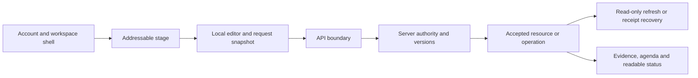

# Phase 7 — Frontend, product reliability and developer experience

Planning baseline: October 5, 2026, America/New_York. Finalized October 6, 2026; plan direction accepted by Hamza on October 6 with the rendering correction recorded below. Acceptance records the plan and its conditional recommendations; it does not select every shortlisted vendor, resolve unspecified operating values, authorize external actions or claim that new acceptance checks passed. This turn updates planning only. Official documentation was researched during the October 5–6 planning session; prices and product terms must be checked again before adoption.

**Accepted release direction:** preserve the current cinematic department identity, make interrupted work recoverable, preserve exact review/delivery boundaries, complete the LinkedIn composer, and turn existing local evidence into explicit release gates. Use SSG or ISR for public static/shared pages; reserve SSR eligibility for personalized or dynamic data. Prefer SSG for release-authored pages and consider ISR only when public content needs independent refresh. Keep the existing React/Vite interactive workflow until a scoped rendering implementation is justified; the policy does not mandate SSR for every authenticated screen. Start with native redacted diagnostics, keep Sentry conditional on accepted data/cost/upload scope, and defer browser OpenTelemetry.

## 1. Scope, provenance and decisions

The reviewed source is `C:/Users/hamex/.codex/worktrees/e2db/meeting-to-tasks`, branch `codex/m2o-revamp`, at `ddfca8251ff37f31ef3f175ca1d50da42833ed6c`. It was clean when inspected at the start. The coordinator identifies this as the published main checkpoint in [M2O](https://github.com/hs14235/M2O). This phase did not independently inspect remote CI or execute a provider request.

The writable saved-project checkout is `C:/Users/hamex/Desktop/meeting-to-tasks/meeting-to-tasks`, initially clean on `main` at `8beac1b49f373cbc5c7e56fd7c9b27bb9d9039b8`. It is older than the reviewed source. No pull, reset, merge, checkout, commit or source copy was performed. **This phase owns only this file**, at:

`C:/Users/hamex/Desktop/meeting-to-tasks/meeting-to-tasks/docs/PHASE_7_FRONTEND_DX_PLAN.md`

Source references below are frozen to the reviewed checkpoint so this older checkout cannot silently become the evidence source. Coordinator-authored skills and the other new planning documents can appear alongside this document without being implementation changes by Phase 7.

| Status | Decision or boundary |
| --- | --- |
| Accepted product scope | Transcript → People → Review & Deliver → Calendar; My day, Meetings, Audit and grouped Settings. Jira, Slack, GitHub and supported LinkedIn capabilities remain core requirements. |
| Accepted ownership | M2O review approval, personal execution, external delivery receipts and provider workflow status are separate. Explicit participant confirmation remains mandatory. |
| Accepted environment direction | Render Free public synthetic demo first; invited private real-data hosting needs a separately accepted persistence, privacy, identity and operating plan. |
| Accepted authorization for this chat | Read-only local inspection, public documentation research, compact planning coordination and this planning document. |
| Accepted Phase 7 direction — October 6 | Async recovery, focused component-boundary cleanup, provisional performance targets, CI/browser gates and native diagnostics first; optional telemetry remains conditional. Hamza said, “I'm fine with all but use Static Site Generation (SSG) or Incremental Static Regeneration (ISR) for static pages, and SSR only for personalized or dynamic data.” |
| Accepted rendering policy | Public static/shared pages use SSG or justified ISR. SSR is reserved for personalized/dynamic routes; client-side interactions continue where needed. Section 11 defines selection, privacy, runtime and acceptance requirements. |
| Remaining product work | Dedicated LinkedIn draft/publishing UI; live provider/product/callback compatibility; hosted behavior and release acceptance. |
| Outside Phase 7 ownership | Backend semantics, models, migrations, credentials, trusted proxies, queue/worker implementation, infrastructure and provisioning. |

The [implementation contract][contract], [Experience V2 contract][experience] and [security document][security] govern these recommendations. Repository and installed Pandora skill instructions were read completely, along with their relevant workflow, motion, calendar, integration and rendered-verification references. The new `skills/m2o-frontend-release/SKILL.md` received a read-only forward review; it was not edited here. The coordinator incorporated the identified telemetry-authorization, synthetic-canary and planning-only execution clarifications; the updated instructions were read again and those gaps are closed.

## 2. Current capability and evidence ledger

| Area | Current source responsibility | Evidence and limit |
| --- | --- | --- |
| Account/workspace shell | [App.tsx][app], [navigation.ts][navigation], [ShellChrome.tsx][chrome] | React history/deep links, dirty guards, session-expiry event, four destinations, lazy feature pages and reversible chrome exist. No SSR renderer is present. |
| Meeting orchestration | [Workbench.tsx][workbench], [MeetingSteps.tsx][steps], [OutcomeCard.tsx][outcome] | Source/index/extract/job/review orchestration; evidence-based outcome editing; expected-version requests; explicit mention confirmation. |
| Handoff | [ShareStep.tsx][share], [Publisher.tsx][github-ui], [JiraPublisher.tsx][jira-ui], [SlackPublisher.tsx][slack-ui] | Choose/prepare/exact-preview/receipt subviews; provider proposal hashes, expiry, receipts and uncertainty. Local download is correctly described as requested, not observed saved. |
| Calendar/personal progress | [OutcomeCalendar.tsx][calendar], [DailyPlanner.tsx][plan-ui] | Approved current-revision feed, dates/undated work, confirmed owners, agenda, bounded cards; personal progress remains independent. |
| Settings/integrations | [SettingsPage.tsx][settings], [Integrations.tsx][integrations], [GoogleMeetImport.tsx][meet-ui] | People/Connections/Privacy/Access/Motion; setup-required and consenting-user flows; latest Meet preview/save, no silent older fallback. |
| Privacy/access | [PrivacyPage.tsx][privacy-ui], `AccessPortal.tsx`, `access-link.ts` | Pending erasure/status/retry, separate external-content retention, invitation/recovery fragments captured without persistent browser storage. |
| Department motion | [DepartmentExperience.tsx][department], [StudioMedia.tsx][studio], `experience.css`, `workflow.css`, `constellation.css` | Original compact CSS scenes and authored clips/posters; calm/system reduced motion; offscreen/background playback pause; data-saver opt-in where browser signal exists. |
| Frontend tooling | [package.json][package], [package-lock.json][lock], [verify.yml][ci], [playwright.config.ts][playwright-config] | Lock records Vite 7.3.5, Vitest 5.0.3, Playwright 1.63.0 and axe Playwright 4.13.0. CI uses Node 22 and typecheck/components/build/audit plus Compose browser checks. No dependency change is proposed as a prerequisite. |

[VALIDATION.md][validation] records October 5 frontend **104 passes in 27 files**, TypeScript and production-build passes, three Experience V2 browser cases, four affected delivery-workflow cases, and four Docker visitor/browser cases. These are distinct runs, not an aggregate count. Its desktop/mobile axe/overflow/motion evidence covers tested states; it is not full accessibility certification. Private invitation/recovery browser evidence is earlier and was not rerun after V2.

The targeted October 5 audit records **94 native passes and four PostgreSQL-only skips**, with no blocking authorization/isolation flaw found in the inspected paths. Those skips are not PostgreSQL concurrency evidence. The broader PostgreSQL acceptance record is dated and contains overlapping runs and post-suite corrections; retain that provenance.

**No application tests, builds, browser journeys, inference benchmarks or hosted checks were run in this planning phase.** Current recommendations are source-grounded; visual defects not reproduced here remain hypotheses. User hardware is treated as CPU/integrated graphics only. No claim of GPU acceleration, model superiority, capacity or production security follows from this plan.

## 3. Required gates versus enhancements

Use two release profiles so a synthetic demo does not accidentally become a private-data launch.

| Priority / release profile | Gate | Owner and evidence needed |
| --- | --- | --- |
| Blocking before public hosting | Resolve shared proxy-client rate-limit buckets, or deliberately adopt/document a global budget; test spoofed headers, unrelated visitors and truthful 429 handling. | Phase 8 semantics/runtime; Phase 7 browser acceptance. Confirmed deployment gate in VALIDATION. |
| Required public demo | Isolated visitors, synthetic-only source, rules/hash mode labels, forbidden upload/grant/send controls, expiry and storage/sleep disclosure; no operator destination details. | Phase 8/9 authority/retention; Phase 7 journeys. |
| Required public demo | Current critical flows must survive recoverable read failure, expired sessions, old asset chunks and route changes without false success, false rejection or automatic writes. | Phase 7; backend recovery contracts from Phase 8. Reproduce specific concerns before fixing. |
| Required public demo | Current packaged artifact, media bytes/MIME/missing-file routing, mobile/keyboard/agenda/calm behavior and real API/worker flow pass. | Phase 7 and one runtime owner; hosted startup/shutdown/recovery remains Phase 8/9. |
| Required private release | Current private onboarding/recovery/offboarding/privacy acceptance, pending-erasure accessibility, protected draft policy and safe provider disclosure. | Phase 7 browser layer; Phase 8/9 backend/storage. |
| Required complete product release | Dedicated LinkedIn source-linked draft/composer, separate publishing grant, public preview, exact approval and receipt/uncertainty journey. | Phase 7 UI; Phase 8 contract review. Core scope is not dropped because the public demo disables real posting. |
| Required live activation | Explicit account/product/permission/callback approval and separately authorized compatibility/delivery tests. No mock counts as this gate. | Hamza/operator and coordinator, with Phase 8 provider owner. |
| Required rendering behavior when public pages are added | Build real public page HTML through SSG, or use justified ISR for independently refreshed public content; keep private data out of generated/shared artifacts. | Phase 7 page/build acceptance; Phase 8 runtime/cache review. Public page inventory and implementation mechanism remain to be specified. |
| Optional enhancement | Sentry, browser tracing, field metrics, additional analytics, richer scenes or ISR infrastructure where SSG is sufficient. | Research/approval first; no optional vendor blocks a useful credential-free demo. |

There is no newly confirmed blocking frontend authorization defect from this review. Important source-confirmed concerns are:

- `Workbench.tsx:99` polls queued/running jobs every 1.2 seconds; its error branch displays an error and does not schedule another status read. A failed GET does not establish job failure.
- `Workbench.tsx:79` and `DailyPlanner.tsx:29` await an accepted mutation and then refresh inside the same error path. Recovery feedback should distinguish write rejection from a failed follow-up read.
- `ShareStep.tsx:21` binds the local artifact to selection/versions/format/evidence, but its preview navigation lacks the stage-generation check used by GitHub/Jira/Slack composers. Its key also excludes destination. A delayed local preparation after stage/provider departure needs a regression test.
- `App.tsx:58` clears account/workspaces on session expiry, unmounting feature editors. Unsaved private edits have no retained-draft path across that event. Retention needs a privacy decision, not silent persistence.
- `App.tsx` uses Suspense without an inspected route error boundary, and source search found no `vite:preloadError` recovery. A missing lazy chunk can strand the workflow after a release.
- `CreateWorkspace` in App has no pending state or in-flight guard. Double activation can issue duplicate create requests. Reproduce with synthetic delayed responses before choosing a small fix.
- `private-lifecycle.spec.ts:10` skips without `MTT_LIFECYCLE_FIXTURE`. The current CI browser launcher supplies demo credentials but not that fixture. A green general browser job does not prove the private lifecycle suite executed.

These are bounded reliability/coverage concerns, not proof that users experienced them. Do not turn them into a broad rewrite.

## 4. Maintainable frontend boundaries

Keep the established components and URL contracts. The shell owns identity, workspace choice, route focus, chrome/motion preferences and authentication transitions. The workbench owns the active meeting resource and orchestration; stage components own unsaved form inputs and commands. Composers own provider-specific fields and readable previews. Calendar and My day own their different date/progress views. The server remains authoritative for permission, source revisions, proposal hashes, expiry and receipts.

Recommended incremental seams, after regression tests exist:

| Seam | Purpose | Smallest implementation boundary |
| --- | --- | --- |
| Meeting resource observation | Separate meeting/list reads from write submission and source/editor state. | Extract only shared load/cancel/current-scope behavior from Workbench if affected fixes become hard to explain; retain its public props and URLs. |
| Job observation | One non-overlapping read loop with bounded backoff, pause/resume and explicit recovery. | Small hook scoped to workspace/meeting/job and auth generation; no new queue, WebSocket or global store. |
| Request outcome | Represent idle, pending, accepted, refresh-needed and rejected separately. | Local state/type at affected command; never a generic helper that auto-retries all HTTP methods. |
| Error presentation | Safe actionable messages, request ID, field paths and retry policy. | Extend `ApiError`/Feedback against an agreed DTO; do not parse business meaning from prose. |
| Delivery presentation | Reuse readable status/payload/receipt sections where behavior matches. | Share display primitives only; keep provider-specific permissions, payloads, retry and reconciliation rules in composers. |
| Draft dirty registration | Combine transcript/outcome/directory drafts without one child clearing another's guard. | Test existing map/registration contracts before changing; preserve Back/Forward rejection and explicit discard. |

Avoid adopting Redux, a routing framework, a server-state library, a form framework or a motion/WebGL package simply to reduce line counts. Existing React, abort controllers and native HTML cover this scope. Reconsider a query library only if repeated cache/invalidation defects are measured across several resources and a proposal includes authority-aware invalidation and an exit path.

For new trust-critical responses, use narrow runtime shape checks rather than assuming `api<T>` validates JSON. It currently provides TypeScript typing, JSON parsing and safe errors; generic typing is not runtime validation. Calendar already checks some snapshot consistency. Do not add a schema dependency or retrofit every DTO without a concrete failure and scoped proposal.

## 5. Async, versions and duplicate activation

The browser snapshot must answer **which user/session, workspace, meeting, source revision, item versions, selection, provider/destination, disclosure choice and stage generation started this request?** Cancellation saves work but cannot undo an accepted server write. A matching stage name alone is insufficient if the user leaves and returns before an old request finishes.

| Command | Browser rule | Server rule / dependency |
| --- | --- | --- |
| Read/list/search/calendar | Abort superseded reads; compare current scope/query/range; ignore late responses; dedupe pagination by ID. | Authorized scope, bounded pagination and correct visibility/counts. |
| Save transcript/outcome/plan | Synchronous in-flight guard as well as disabled controls; retain input on rejection; accepted-write feedback precedes refresh. | Existing expected-version/source checks; no client-created approval. Backend idempotency requirements reviewed per command. |
| Prepare local/provider preview | Bind all choices and relevant versions; increment stage generation on departure; reject stale result/navigation. | Stored exact snapshot/hash/expiry and permission validation. |
| Approve delivery | One deliberate click against current preview; do not optimistically celebrate delivery; preserve returned operation/job. | Authoritative current hash, destination/grant generation, version and authority checks; durable intent deduplication. |
| Restore after timeout/cancel | Read current resource/receipt where safe; show outcome unknown if acceptance cannot be established. | Operation recovery or domain-specific safe query; never a blind POST replay. |
| Reconcile/retry | Only server-advertised action, clearly labeled as read reconciliation or explicit known-rejection retry. | Existing `can_reconcile`/`can_retry_rejected`; LinkedIn currently supports neither. |
| Disconnect/erase | Disable repeated activation; retain returned state; explicit confirmation is scoped to the action. | Revocation/freeze wins over delayed callback/worker response; pending erasure is not completed erasure. |

Required synthetic regressions: leave/return during local preview, change provider while preview waits, switch meeting/workspace during save or read, reconnect/disconnect while a preview exists, mutate source/version during approval, double-click with delayed responses, accepted write followed by failing GET, and logout/expiry during polling. Include React StrictMode effect re-entry for link capture and read setup. Verify network counts and final visible state, not only button text.

Do not disable safety errors to obtain smooth navigation. Do not persist proposal approvals in browser storage or transfer them to another login. Refresh restores state only through currently authorized server reads.

## 6. API/error/readiness contract with Phase 8

Current [api.ts][api] reads `{error, request_id}`, throws `ApiError(status, message, requestId)`, and emits a session-expired event for protected 401 responses. The backend also supplies sanitized validation field locations/types and `X-Request-ID`. Phase 8 and Phase 7 agree the following as a **proposal**, not implemented fields:

- Preserve safe message and request ID; add a stable safe `code` where useful, optional bounded `retry_after` backed by actual quota expiry, and accepted operation/job identity where recoverable.
- Field errors contain safe field paths/types, never submitted values, tokens, raw provider bodies or internal exception text.
- Separate liveness, database/schema readiness, worker freshness and provider capability. Readiness success does not prove extraction progress or live provider availability.
- Safe mode/capability disclosure may state synthetic/rules operation and capability absence; it must not expose destinations, authors, credentials or consent URLs to visitors.

| State | UX and next action | Retry/write policy |
| --- | --- | --- |
| Initial session check | Calm loading status with bounded wait and manual recovery if unreachable. | Read-only retry; do not silently create a visitor session. |
| Slow request / 202 | Show submitted/queued and known operation identity; offer later status inspection. | Queue acceptance is not provider delivery. |
| Network/offline | Explain connection failure; retain authorized in-memory editor input under accepted policy; disable submitting while offline hint is active. | `navigator.onLine` is a hint, not reachability proof. No persistent offline write queue. |
| 401 / expired visitor | Clear protected scope; private reauthentication or fresh isolated demo; do not restore private data to a different account. | Stop polling and invalidate previews. No automatic sign-in or resend. |
| 403 | Explain permitted action/role or origin failure without revealing hidden resources. | Recheck permission through safe reads; never encourage bypass. |
| 404 | “This item is unavailable to your account” with a safe route back. | Preserve non-disclosure; do not distinguish foreign/private/not-found records. |
| 409 | Keep local edits; explain stale revision/version; offer current-state reload/review. | Explicit reconcile/edit decision; invalidate old previews; no silent overwrite. |
| 413 / 422 | Show permitted size/format or safe validation fields and retain the editor. | No same-payload retry loop; fix input. |
| 429 | Explain limit, countdown only when server supplies real expiry, preserve draft. | Respect server policy; no rapid retry or keepalive workaround. |
| 502 / 503 / non-JSON gateway response | Show service temporarily unavailable; preserve known accepted result and request context. | Bounded safe GET retry/manual action; never treat malformed response as write rejection. |
| 504 / write timeout | Say result needs checking; recover current import/resource/receipt as supported. | Do not create a second import/delivery because the browser stopped waiting. |
| Failed status/history GET | Keep last confirmed status with stale/read-failed label and refresh action. | Failure to read history does not mean nothing was sent. |
| Uncertain provider write | Persistent explanation and only permitted recovery controls. | Never automatic resend; LinkedIn requires human account inspection and no fabricated permalink. |
| Empty review/calendar/plan | Explain why it is empty and offer extraction, review, range adjustment or another plan day. | Distinguish loaded-empty from loading/error/partial pagination. |
| Frozen/pending erasure | Ordinary work stops; privacy status and authorized explicit retry remain reachable. | Do not restore source/provider work; external content/backups have separate retention. |
| Lazy chunk failure | Route error boundary with accessible “Reload current app” action, dirty-work handling and loop guard. | No unconditional refresh that discards an editor or repeats a mutation. |

Current runtime difference: API `/healthz` means alive and `/readyz` checks DB/schema. Hosted wrapper forwards them unchanged; Nginx exposes `/healthz` by forwarding it to API `/readyz`. The client must not infer identical meanings from launcher paths. Phase 8 owns normalization/documentation and any expected-schema/worker-freshness proposal. No browser polling of operator diagnostics or provider configuration is required.

Polling recommendation: one active GET at a time, scope/session fence, pause in hidden tabs/offline states, bounded backoff on transient reads, and a manual resume path. Set concrete intervals/timeouts with Phase 8/9 after measuring queue latency and request load; do not assume the current 1.2-second interval is optimal. Resume reads, not writes. A hung worker needs backend freshness/recovery evidence, not an infinite spinner or frontend health claim.

Private-draft recommendation for decision: keep unsaved text only in memory behind reauthentication for the same account if Hamza accepts that policy; hide protected content immediately, clear it on logout/account switch/visitor expiry and expire retained memory after an agreed bound. Default implementation must not start writing transcripts to localStorage, sessionStorage, IndexedDB, service-worker cache or telemetry. If even memory retention is unsuitable for private departments, retain current clearing behavior and disclose the loss clearly.

## 7. End-to-end acceptance journeys

### Visitor — useful synthetic outcome without accounts or secrets

1. Start an isolated demo; see synthetic-only and temporary storage/access disclosure, actual rules mode and hosting sleep limitation.
2. Choose each department's approved example, inspect immutable source, confirm suggested people explicitly, extract and review current outcomes.
3. Review one outcome at a time, approve its current version, use Calendar/Agenda including undated work, add eligible work to My day and complete personal progress.
4. Prepare exact Markdown/JSON with evidence off by default; enable it deliberately and inspect changed content. Download request is not a saved-file guarantee.
5. Inspect Connections and unsupported provider subviews: no operator names/destinations/grants or false live success. Custom upload/import/send/admin paths remain denied at both UI and API layers.
6. Reload/deep-link/Back/Forward, collapse both chrome regions, use keyboard and mobile calm mode. Run an independent browser visitor and verify denied cross-scope access. Expire the session: show fresh-demo action without recycling its approval or data.

### Invited user — private source and personal plan

1. Consume an email-bound, single-use invitation from a synthetic fixture; choose own credentials or authenticate as the matching existing account. Tokens leave the URL fragment promptly and never enter capture/log/storage artifacts.
2. As editor, paste/upload permitted UTF-8 text or inspect honest Google setup/absent/processing/reconnect states. Preview and explicitly save an import with the selected visibility. Provider participant labels remain unconfirmed.
3. Save/index/extract through real API/worker/PostgreSQL. Stop a status read or network response deliberately; show recoverable read state without reindexing/extracting blindly.
4. Confirm people, prepare edits and hand them to a reviewer; viewer/editor authority stays visible and enforced. Plan only eligible reviewed work for the signed-in user.
5. Expire login during an unsaved edit, exercise the accepted draft policy, reauthenticate as same/different account and test no cross-account restoration. Operator recovery revokes the old session.
6. Export own data, inspect local-versus-provider disclosure and verify download-request feedback. Account deletion, last-owner constraints and pending workspace erasure must match current server truth.

### Reviewer — evidence, exact approval and uncertainty

1. Open permitted/restricted meeting; confirm owner/date and inspect evidence, including no-outcome and ambiguous-name cases.
2. Save/approve current versions; change transcript/outcome in a second authorized context, then verify stale edit/proposal rejection preserves input and demands renewed review.
3. Enter stage 3 delivery; inspect exact source selection, destination/author, visibility/evidence and payload/hash/expiry. Review approval alone never sends.
4. Approve once using synthetic provider responses plus real backend intent/worker/receipt tests. Delay approval response and fail receipt reads; recover via server operation without duplicate writes.
5. Exercise rejected/conflict/partial/uncertain receipts. Only supported server retry/reconcile appears. Delivered resource status and personal progress remain separate; freshness is explicit if status observations are later added.
6. Run LinkedIn draft/public-post journey after composer implementation: shared draft disclosure, separate grant, explicit PUBLIC review, no outreach sending, no arbitrary person lookup, no uncertain retry or guessed URL.

### Operator — run and diagnose without leaking configuration

1. Fresh clone at the intended implementation revision; preserve existing env files. Run the documented synthetic setup without providers/model downloads, check actual API/worker/schema and open the demo.
2. Distinguish boot/migration failure, unavailable database, stale worker, API unreachable, and optional model absent. Surface safe action/runbook links; never ask invited users for client secrets.
3. Create a local owner through the private CLI prompt; owner manages invitations, operator handles documented manual recovery. No email service is implied.
4. Inspect provider capability/setup checklist without exposing secrets to browser DTOs. Connect/disconnect replaces grant generations and invalidates pending previews.
5. Diagnose a synthetic failed read with request ID/build/route template, verify no transcript in support details, inspect pending erasure and follow Phase 8/9 recovery procedures.
6. Validate cold/warm hosted behavior only after separately authorized deployment. Operator owns expiry notices, backup/restore/private-hosting decisions and incident response; a green UI cannot make Free hosting durable.

## 8. Provider integration gap matrix

These are existing core requirements and activation gates, not requests to add arbitrary vendors. [README][readme], companion provider guides and actual server capabilities remain the source of truth.

| Surface | Existing interface/source | Next frontend acceptance / gap | External boundary |
| --- | --- | --- | --- |
| Local handoff | Exact Markdown/JSON; reviewed versions; evidence toggle; download-request receipt. | Stage-generation regression, stale preview, interrupted preparation, reload explanation and mobile full-content inspection. | No provider or fee; local exported file is a deliberate disclosure. |
| GitHub | Connection/destination UI and exact publisher with stored previews/receipt recovery. | Permission/destination/grant invalidation, late preview, content conflict, history failure and allowed reconcile/rejected retry. | Real repository token/issue permission and allowlist require private operator setup; live compatibility is unverified. |
| Jira | OAuth/destination/field metadata and exact create/update composer. | Unsupported required fields, reauth/revocation, update conflict, approval expiry, operation recovery, concise mobile preview. | Operator app and user consent are distinct; invited users need no personal developer app. Live product/account behavior remains unverified. |
| Slack | Connection/delivery/update plus explicit mapped actions. | Distinguish message receipt from M2O action authority; workspace mapping/revocation and safe action status. | Signed interactive ingress needs awake endpoint/ack budget; Free sleep does not establish that. Public synthetic demo cannot send. |
| LinkedIn profile | Own-profile connection and clear directory-confirmation limits. | Separate identity context from publishing grant, self-disconnect and visitors' capability absence. | OIDC describes the consenting member; it does not provide identity verification or transcript-name lookup. |
| LinkedIn drafts/posting | Backend draft/consent/preview/operation/receipt paths; Share UI currently shows connection guidance rather than a composer. | **Required dedicated composer**: exact manual post/outreach text, source versions/staleness, shared visibility notice, separate grant/connect/disconnect, PUBLIC preview and exact approval, receipt recovery. | Member posting needs granted `w_member_social`; no automated outreach messaging. Existing API pins a version and `/rest/posts`; real author/product compatibility must be checked before activation. |
| Google Meet source | Latest-accessible transcript import UI, preview/save and Connection panel. | Missing/active/processing/expired/incomplete/time-limit/reconnect states; unchanged source reuse; visibility and late save response. | Read-only source import, not recording, transcription generation, Calendar sync or outcome delivery. Existing transcript/app/user authorization required. |
| Future provider status sync | Ownership policy exists; no automatic bidirectional completion should be introduced. | Show source/last-observed freshness only from tested backend DTO. | Separate scope, transition mapping, conflict/event/idempotency review needed before any sync implementation. |

LinkedIn composer should use existing documented DTOs rather than alter OIDC or invent a general social integration. Its local drafts are visible to authorized meeting/workspace members, including viewers; label them accordingly. Default text must not automatically copy raw transcript evidence. Draft save is distinct from preview and delivery approval. Preserve the latest-50 list bounds and version-checked edits; do not claim a complete history if pagination is absent. Existing backend permits local synthetic drafts, but public publication controls must remain unavailable. See [LinkedIn delivery contract][linkedin-contract].

The official [OIDC guide](https://learn.microsoft.com/en-us/linkedin/consumer/integrations/self-serve/sign-in-with-linkedin-v2) documents own-member sign-in, and [Share on LinkedIn](https://learn.microsoft.com/en-us/linkedin/consumer/integrations/self-serve/share-on-linkedin) identifies member-posting permission. Their existence is not proof that this application's products/scopes are granted. The Share tutorial's example endpoint must not replace the inspected adapter's protocol without the backend owner's compatibility review.

## 9. Cinematic direction, accessibility and mobile polish

Keep equally developed People Operations, Finance and Engineering experiences, dimensional department motifs and original celestial calendar. The next polish should make the active decision easier to read: compact stage 3, stationary evidence, clear selected outcome, small finite saved-state feedback, and useful disclosure controls. No new artwork service, WebGL renderer, heavy motion package or full redesign is justified by the inspected evidence.

Current studio source reserves 640×480 dimensions, uses `preload="none"`, attaches video sources when appropriate, pauses background/offscreen video, preserves user pause and presents a poster after failure. Compact heroes use CSS scenes. Verify those separate mechanisms; do not call all graphics video or claim resource savings from file size alone.

Acceptance requirements:

- Native keyboard/touch controls and readable Agenda remain equal paths to Calendar. Do not apply ARIA grid semantics unless its complete navigation/focus behavior is implemented.
- Dates remain reviewed date-only values; preserve local-noon/date arithmetic and undated hints. Never place an item using its creation date, personal plan date or unreviewed “Friday.”
- Confirmed names, unassigned ownership, selected/current source and partial-feed counts must remain readable without color, hover, motion or constellation position.
- Calm and system reduced motion remove decoration while retaining controls, focus/status feedback and all evidence. Continuous decorative motion needs applicable pause/stop behavior; verify compact CSS scenes as well as studio clips. [W3C pause/stop/hide guidance](https://www.w3.org/WAI/WCAG22/Understanding/pause-stop-hide.html).
- Test widths 320, 390 and representative desktop, plus both sides of actual 580/600/850px and other affected breakpoints. These are proposed test profiles, not newly observed renders.
- Test long names/titles/IDs, expanded evidence/preview/history, onscreen keyboard, touch, 200% and 400% zoom/reflow, focus visibility, readable contrast through transitions, screen-reader sequence and error announcements.
- Reopen controls remain reachable outside hidden/inert chrome, restore focus sensibly, and never cover stage actions. “Outcome to review” stays compact on mobile.
- Blocked autoplay, decode failure, absent IntersectionObserver, unavailable browser storage and data-saver signal absence keep the poster and workflow usable. Data saver is best effort, not a universal mobile detection claim.

Automated axe checks run in important expanded/error states, not only initial pages. Manual accessibility and device checks complement them. [Playwright accessibility guidance](https://playwright.dev/docs/accessibility-testing) explicitly distinguishes automated detection from manual assessment. Do not hide meaningful violations or relax assertions for attractive screenshots.

## 10. Performance, assets and cache strategy

Source file sizes measured in this planning pass:

| Department | MP4 bytes | WebP poster bytes |
| --- | ---: | ---: |
| Engineering | 107,021 | 12,606 |
| Finance | 138,815 | 14,554 |
| People Operations | 88,158 | 10,280 |

Six media files total **371,434 bytes** before HTTP overhead. This is a filesystem measurement, not bundle size, decode cost, visual seam quality, mobile battery impact or Core Web Vitals evidence.

Recommended measurement ledger: source SHA/build ID, runtime launcher, browser/device, viewport, synthetic scenario, warm/cold cache and API state, network/CPU profile, asset transfer bytes, requests, lazy chunks, task long blocks, LCP/INP/CLS, meaningful route-to-content delay and command-to-accepted/receipt delay. Keep API cold start, indexing/extraction/queue time and frontend rendering as distinct clocks.

Proposed targets, pending baseline measurement and review:

| Measure | Target or review trigger | Interpretation |
| --- | --- | --- |
| Field Core Web Vitals | p75 LCP ≤2.5s, INP ≤200ms, CLS ≤0.1, segmented mobile/desktop. | Official reference targets, not current M2O results or a promise on sleeping hosting. |
| Reproducible lab scenarios | Frozen synthetic route/profile runs; report variability and compare the same build/runtime/profile. | Lab results find regressions; they do not establish field INP or production capacity. |
| Compressed JS/CSS | Measure shell and stage chunks first; proposed review trigger if an increment adds >10% or >25 KiB compressed initial-route JS. | Provisional review threshold, not a measured budget. Reject unjustified dependencies; tune after baseline. |
| Decoration | No video transfer before eligibility/visibility; no continuing video playback in hidden/calm state; no workflow waiting for motion. | Verify requests/playback, not CSS class alone. |
| Route/data loops | One active status request per resource; bounded list/feed/card/page rendering; no steady retry storm. | Counts derived from tests and Phase 8/9 load evidence. |
| Asset correctness | Real status/MIME/SHA-256, cache headers and missing-file 404 on native/package/hosted target. | Build success alone does not prove served media. |

The numerical Web Vitals references come from [Google's Web Vitals guidance](https://web.dev/articles/vitals); field and lab evidence must remain distinct. Use DevTools/manual synthetic recording first. Adding the `web-vitals` package or a reporting endpoint is optional and requires the same dependency/privacy review as telemetry; full metric attribution can reveal element text/selectors or URLs.

Current Nginx caches Vite hashed assets immutably, revalidates HTML and stable media names, and keeps API responses no-store. The hosted wrapper separately implements these semantics. Retain same-origin asset loading and strict CSP. Do not give `/scenes/engineering.mp4` immutable year-long caching while its filename can be reused for changed bytes. If media hashing is later justified, update manifest/source references and old-client compatibility coherently with the runtime owner.

Vite 7 documents `vite:preloadError` and noncached HTML for stale chunk recovery. [Vite 7 build/load guidance](https://v7.vite.dev/guide/build#load-error-handling). Add an accessible controlled reload boundary rather than blindly copying its reload example into a private editor. Retain prior hashed assets where the hosting packaging strategy supports it, but do not assume Render preserves every prior file. Test an old open tab against a new/rolled-back artifact with dirty input and failed chunks.

Do not add a service worker/offline cache now. Private responses, editor data, credentials and approvals must not become persistent offline artifacts; reconnecting must revalidate current authority. A future offline product requirement would need an explicit encryption/retention/logout/erasure and conflict design.

## 11. Accepted rendering policy — SSG/ISR for static pages, selective SSR

Hamza accepted the Phase 7 direction on October 6 with this correction: use **SSG or ISR for static pages, and SSR only for personalized or dynamic data**. This supersedes the earlier rendering recommendation. The current reviewed implementation is still React/Vite client rendering; no SSG, ISR or SSR behavior has been implemented by this planning amendment.

| Page/data class | Selected approach | Reason and boundary |
| --- | --- | --- |
| Public landing, privacy, setup and other release-authored information, when added | **SSG by default:** generate complete HTML at build time and serve the artifact. | Content can ship with a reviewed release. First content needs no API, session or request-time renderer. |
| Public content updated independently of application releases, if that requirement appears | **ISR where justified:** cache generated public HTML and regenerate through a controlled runtime. | Specify acceptable staleness, refresh triggers, last-known-good behavior, cache ownership and operating cost. No such independent-content source is currently established. |
| Personalized or dynamic workspace data | **SSR eligible only here**, where initial server-rendered data produces a concrete benefit; otherwise preserve current client rendering. | Authenticate each request, preserve workspace authorization and private response isolation. Do not place transcripts, reviews, plans or grants in shared SSG/ISR artifacts. |
| Editors, job/receipt observation, calendar interactions and motion | Client-side interaction continues after static HTML or an SSR response as appropriate. | Rendering method does not replace current versions, explicit confirmation, exact delivery approvals or API authority. |

SSG and ISR are different operating choices. Build-time generation can retain the current static-serving architecture. ISR requires regeneration/cache behavior beyond a static export. The official [Next.js ISR reference](https://nextjs.org/docs/app/guides/incremental-static-regeneration) describes cached HTML, background regeneration, failure handling and runtime requirements; it is a mechanism reference, not a decision to adopt Next.js. A full framework migration is not required merely to generate a few public pages. The selected framework/host must prove its own ISR support before it is proposed for M2O.

The current Vite build creates a static application bundle, which does not by itself prove that every route's page content was generated as HTML. For SSG acceptance, inspect the actual generated public documents with JavaScript disabled. [Vite 7 static deployment guidance](https://v7.vite.dev/guide/static-deploy). Plain static documents or a small build-time renderer can serve the public information pages while the existing application owns protected workflows. React's [renderToStaticMarkup reference](https://react.dev/reference/react-dom/server/renderToStaticMarkup) describes non-interactive HTML that cannot be hydrated; interactive page requirements need an appropriate hydration-capable generation mechanism rather than treating that API as interchangeable with SSR hydration.

If selective SSR is later adopted, review the renderer process, session forwarding, private-response caching, hydration/error boundaries, resource use and release compatibility. It does not fix a sleeping API/worker or eliminate approval checks. React's [server rendering reference](https://react.dev/reference/react-dom/server/renderToPipeableStream) explains those responsibilities. This is an architectural tradeoff inferred from that mechanism and M2O's workflow, not a claim that a renderer exists.

Rendering acceptance requirements:

- Public generated pages contain reviewed content without JavaScript or authenticated/API access; signed-in and anonymous requests do not inject personal data into the same cached document.
- Build output and generated metadata contain no private source, participant identity, workspace IDs, grants or secrets. Critical policy changes publish through a reviewed content release; do not leave freshness to an unspecified ISR interval.
- Generated public routes, protected application deep links, unknown assets and unknown API routes preserve their distinct routing/404 behavior. Phase 8 owns any shared static-wrapper/Nginx change.
- If ISR is selected, test fresh/stale/regenerating/error states, authorized invalidation, concurrent regeneration, last-known-good behavior, restart/cache loss and version rollback. Only public, safely shareable data is eligible; stale policy content needs a defined maximum age.
- If SSR is selected, test two different users/workspaces, unauthenticated access, private cache isolation, session expiry, escaping, hydration consistency and current API/version checks. HTML containing private user data is not publicly cached.
- Record build/runtime/bundle/resource evidence for the chosen mechanism. No new dependency, host service or account is implied by acceptance of this rendering policy.

## 12. Frontend CI and regression gates

Current workflow already runs typecheck, Vitest, production build, npm high-severity audit, backend PostgreSQL checks, Compose build/start and Chromium browser acceptance. This phase did not run or verify hosted CI. Extend existing tools and explicit fixture lanes, not a second testing stack.

| Lane | Proposed scope | Passing evidence required |
| --- | --- | --- |
| Focused component | Changed error/recovery/async/calendar/composer boundary. | Delayed-response, duplicate activation, scope/version/expiry, accepted-write-read-failure regressions. No mocks bypassing core guards. |
| Frontend affected suite | Typecheck, component suite and production build with lockfile. | Exact command, revision and result; unrelated pre-existing failures reported. |
| Public real-runtime browser | All departments, independent visitors, source→people→review→calendar→plan→local handoff, links/reload/dirty guards. | Real API/worker/PostgreSQL; no provider credentials or model requirement; no silent skipped required tests. |
| Private lifecycle browser | Dedicated disposable API/worker/schema at the existing guarded fixture target. | New/existing invitees, recovery replay/revocation, export/account/workspace erasure, other-workspace preservation and pending status. |
| Provider UI contracts | Synthetic metadata/preview/approval/receipt/reconnect/conflict/uncertainty. | Explicit mock labels; pair with backend intent/worker/database tests. Separate live activation later. |
| Mobile/accessibility | Important normal/error/expanded pages; keyboard/focus/reopen/agenda/reduced motion; viewport boundaries. | No overflow or covered primary controls; axe results plus manually inspected rendering. |
| Packaged frontend/media | Exact image/static root/CSP/cache/deep-link/missing assets, playback and paused behavior. | Read-only asset checker plus actual browser rendering. |
| Release compatibility | Prior tab + current assets/API, accepted operation across reload, optional telemetry disabled. | No approval replay, wrong-scope state or forced dirty reload. |

The private lane must create its own fixture and exercise the existing guard; do not remove `test.skip` or relax target validation while failing to supply a safe runtime. Backend `scripts.lifecycle_browser_runtime` already creates a named disposable PostgreSQL schema and tears down only its own schema/fixture; it requires a current built frontend. Phase 8 owns CI supervision/cleanup and runtime changes; Phase 7 owns tests. Serial workers currently protect shared actors. Parallelize only after independent actor/schema fixtures exist.

Use existing `frontend/e2e/visitor.spec.ts`, `workflow.spec.ts`, `experience-v2.spec.ts` and `private-lifecycle.spec.ts`. Preserve meaningful isolation/approval assertions. Include feature-to-evidence coverage in release notes, not a single undifferentiated green badge. [Playwright CI guidance](https://playwright.dev/docs/ci-intro) is a reference; repository scripts determine actual safe runtime setup.

Artifacts are a data boundary. Current Playwright traces are off and screenshots occur on failure; framework error snapshots can still contain source content. Use synthetic inputs only, inspect screenshot/trace/HTML/JUnit/log output before any authorized upload, and set approved retention/access. No third-party visual testing/cloud-browser service is justified yet. Standard GitHub-hosted runner usage in public repositories is free, while larger runners and some storage/other usage have separate billing; private allowances differ. [GitHub Actions billing](https://docs.github.com/en/billing/concepts/product-billing/github-actions). Do not infer the account's actual plan, remaining quota or approval to change settings.

## 13. Fresh-clone and operator developer experience

Keep the short [README setup][readme] and [local development guide][local-dev] as the entry points. The documented Docker demo needs Python 3.13 plus Docker/Compose; native frontend development needs Node. CI uses Node 22; verify exact supported versions against the lockfile/toolchain when implementation starts. On PowerShell use `npm.cmd` if script policy blocks `npm.ps1`.

Fresh-clone acceptance should demonstrate, in a disposable checkout/runtime:

1. Verify clean revision and prerequisites. Run `python scripts/configure_local.py` only when no private configuration already exists; then `docker compose up -d --build web worker` as documented. No provider account, model download or shared demo password is required.
2. Observe migrations/API/worker/database/web, open documented local route, complete one synthetic outcome and show actual extraction mode. Identify process/port conflicts clearly rather than resetting data.
3. Existing configuration remains intact on rerun. Stop uses `docker compose stop`, preserving volumes. No `down -v`, shared DB reset or recursive cleanup belongs in troubleshooting.
4. Native setup launches API, worker and Vite against the intended database. Explain that a container and native worker can compete for the same queue; intentionally stop the appropriate owned worker for debugging.
5. Full test fixtures stay synthetic and ignored; browser credentials are passed via existing launcher/fixture, not copied into logs or chat. The `.runtime` directory is not a repository artifact.
6. Optional local Ollama follows existing setup and measured CPU evaluation; demo is useful without it. Integrated graphics do not justify a GPU claim or moving transcripts to a cloud model.

Recommended operator setup UX: a read-only checklist of application mode, schema compatibility, worker observation, optional inference readiness and provider feature/configuration/grant/destination stages. Public visitors see only safe capability absence/mode. Private users see their own grant and authorized destination status. Operator configuration instructions point to docs/private CLI; client secret, encryption key or signing-secret fields never appear in ordinary browser forms. Do not build an operator dashboard until Phase 8/9 define least-privilege DTOs and a demonstrated operational need.

Add a concise troubleshooting table in the existing guide during implementation: session/origin/CSRF mismatch, unavailable API, schema mismatch, missing worker, optional model absent, grant expired, destination invalid, stale preview, uncertain write and pending erasure. Include source responsibility, safe next action and request ID; do not request full `.env`, database dumps or real transcripts as bug reports.

## 14. Bounded monitoring shortlist and due diligence

The gap is browser failures that never reach FastAPI: render/chunk exceptions, unreachable fetch and device-specific interactions. Existing safe API logs/request IDs help correlate server failures but do not capture every browser exception. Monitoring is useful only if someone owns triage and its data flow is acceptable. A native baseline is recommended for the synthetic release; external reporting is an optional separately approved change.

### A. Native redacted support reporting — recommended baseline

Benefit: give Hamza/operator enough context to investigate without a new service. Proposed route error boundary and “Copy support details” could expose only app build ID, mode, route template, safe event/error code, HTTP status and request ID. Current api/Feedback already display safe request IDs; a full support envelope/error boundary is proposed, not implemented.

Data stays in browser memory/explicit local copy until a user chooses to share it. Do not include meeting/workspace IDs, transcript/title/people, DOM text, payloads/hashes, query/hash/referrer, tokens/cookies, headers/bodies or raw exception context. Clipboard content has its own privacy boundary; preview before copying. Never send the report automatically.

No vendor fee or extra auth scopes. Existing operator log retention and incident handling remain Phase 9 decisions. Cost is developer time, manual triage and possible failure to receive reports. Guard reporting against recursion/oversized messages; application remains usable when diagnostics fail. Exit by removing the display/copy action; no provider-held data to migrate. Alternative of adding nothing: retain safe errors and manual synthetic reproduction, accepting weaker visibility. Validate with synthetic canaries, offline/read error and thrown render/chunk failure; inspect the resulting copy/envelope and confirm no outbound telemetry.

### B. Sentry hosted React error monitoring — optional after review

Benefit: group browser exceptions by release and notify an operator when manual reports miss failures. This fills the client-exception gap; it does not replace backend job/queue/backup monitoring. Start error-only, without replay, performance auto-instrumentation, profiling, logs/AI integrations, feedback uploads or screenshots. A package/account is not accepted by this document.

Official [pricing](https://sentry.io/pricing/) read during this session: Developer is **$0**, one user, **5,000 errors/month**, 30-day lookback. Team lists **$26/month billed annually ($312/year)** with default prepaid data; official page structured pricing lists **$29 monthly**, and the base error allowance is **50,000/month**. Extra usage/products and tax are separate. Upgrade only for accepted multi-operator/integration or measured event-volume needs. Lookback is not a guaranteed deletion/backup-retention policy; verify region, deletion, subprocessors, terms and effective controls before private use. No account budget or auto-upgrade is assumed.

The current official [React data collection guide](https://docs.sentry.io/platforms/javascript/guides/react/data-management/data-collected/) documents default IP/query/referrer and console breadcrumb collection, plus URL paths that category controls cannot disable. Therefore a PII flag alone is insufficient. Use an explicit final-event allowlist, path templates, no query/hash/referrer, no user identity or automatic DOM/console breadcrumbs, and inspect every enabled channel. Direct browser transport also reveals the network source IP regardless of event scrubbing. [Filtering hooks](https://docs.sentry.io/platforms/javascript/guides/react/configuration/filtering/) permit client-side editing/dropping before transmission; actual supported options must be checked against the selected SDK. Replay is omitted, not trusted to transcript masking.

Auth: a browser DSN is an ingest identifier, not a privileged management token; review ingest-abuse/quota controls. An optional build plugin requires a private build token and may upload source maps/original source. [Sentry Vite source-map guide](https://docs.sentry.io/platforms/javascript/guides/react/sourcemaps/uploading/vite/) documents organization tokens or a personal token with Project Read/Write and Release Admin permissions. Source uploads need separate explicit approval. Never put management/build tokens in a `VITE_` value. First acceptance can omit source maps and retain build/minified-frame correlation, with reduced debugging precision.

Maintenance: SDK/bundler compatibility with React/Vite 7, advisory/license review, CSP ingest destination, release matching, safe sampling, filters, data retention, triage and cost caps. A hosted tunnel would add backend traffic/abuse cost and is not free by definition. SDK/ad blocker/quota/vendor failure must not block editor/save/approval or create a reporting loop. Keep a narrow reporting adapter and disable switch; removing initialization/dependency/CSP allowance is the exit path, with vendor deletion separately verified.

Before acceptance: test transport against synthetic canary strings in transcript/title/name/URL fragment/query/body/console/exception; inspect actual envelopes/network, not just configuration. Test offline/vendor blocked/quota failure, StrictMode/deduplication, bundle delta and disabled behavior. A real vendor smoke would use synthetic error content only after explicit authorization. No source, transcript, event or source map was sent in this phase. Alternative: native baseline/manual triage.

### C. OpenTelemetry browser tracing — defer

Benefit after a demonstrated need: connect slow client activity to API/worker traces through a controlled collector/export path. It is not a turnkey browser error inbox. Existing native clocks/request IDs may be sufficient before there is sustained private traffic or an accepted telemetry backend. Official [browser documentation](https://opentelemetry.io/docs/languages/js/getting-started/browser/) still marks browser instrumentation experimental; JavaScript component stability does not establish stable browser auto-instrumentation.

Potential data includes route/resource URLs, headers/attributes, interactions and trace IDs. Require explicit allowlisted spans, template routes and same-origin propagation targets; no DOM/source bodies, auth, transcript or user/workspace/provider identifiers. A trace/request ID is correlation data and must never serve as authorization. Retention/deletion is determined by the chosen backend, not by the SDK. [OpenTelemetry sensitive-data guidance](https://opentelemetry.io/docs/security/handling-sensitive-data/) supports minimizing/redacting what is exported.

The open-source instrumentation has no hosted monthly allowance to quote; collector/backend/storage/egress/alerting and operator time are separate costs. No paid backend is selected. A collector needs authenticated/rate-limited ingress and secret handling; privileged export credentials do not belong in browser code. Maintenance includes experimental APIs, sampling, propagation/CORS/CSP, queue size and collector upgrades. Drop telemetry on export failure, keep buffers bounded/in memory, and never queue private events persistently. Exit by removing export/instrumentation while retaining local clocks/request IDs. Validate small synthetic same-origin trace chains, forbidden data, sampling/cardinality, blocked collector and bundle/runtime overhead before comparing against adding nothing.

### Shared telemetry contract with Phase 9

Low-cardinality allowlist recommendation: environment/build, coarse route template, safe event/error code, HTTP status, duration bucket, mode and coarse viewport/motion category only when necessary. Request/operation correlation stays in restricted diagnostic records after disclosure review, not metric labels. No raw user/workspace/meeting/provider IDs, names/emails, URLs/query/hash, transcripts/drafts/payloads or source contents.

Separate measurements for frontend load/interactivity, API response, queue delay, extraction and delivery receipt freshness. Sampling, caps, retention/deletion/access, operator ownership and alert routing require one Phase 9 policy. No session replay or user tracking is recommended. Alerts are operational events, not automatic user notifications or automatic provider retries. External alert destinations need explicit approval.

## 15. Dependency order, shared-file ownership and acceptance

| Increment | Work / dependency | Exit gate |
| --- | --- | --- |
| P7.0 — contracts | Coordinator reconciles Phase 7/8/9 decisions: safe errors/readiness, accepted-write recovery, privacy/drafts, metrics/mode disclosures and the accepted SSG/ISR/selective-SSR policy. | Written accepted DTO/ownership ledger and public/dynamic route classification; optional tool choices remain conditional. |
| P7.1 — reliability | Reproduce source concerns with synthetic async tests; smallest fixes for local preview generation, polling/read recovery, chunk boundary and duplicate activation. | Focused regressions, typecheck/components/build, affected real-runtime journey; no provider write or cross-scope regression. |
| P7.2 — complete provider UI | LinkedIn composer against existing draft/grant/preview/receipt contracts; provider gap-matrix failure states. | Synthetic UI and backend-path acceptance; exact public disclosure; no unsupported message/retry/lookup claims. |
| P7.3 — purposeful polish and public rendering | Only reproduced mobile/keyboard/motion/agenda/readability issues; baseline bundle/media measurements; public SSG pages and justified ISR if required, with scoped SSR only for personalized/dynamic routes. | Inspected desktop/mobile/zoom/calm/error states, generated-HTML/private-cache acceptance, asset checker and packaged browser evidence. |
| P7.4 — release/DX | Fresh-clone onboarding, dedicated private fixture CI lane, operator/runbook/support details; optional approved error telemetry. | All required lanes actually executed at one named candidate; mock/skip/hosted/live evidence separated. |
| P7.5 — hosted acceptance | After Phase 8/9 runtime/persistence/proxy gates and separately authorized deployment. | Real synthetic hosted cold/warm/expiry/recovery/media/session measurements; private live integration remains separately gated. |

Future ownership, assigned explicitly by coordinator before edits:

- Phase 7: `frontend/src/**`, relevant styles/assets, frontend component/e2e tests and frontend/DX documentation sections.
- Phase 8: backend DTO/error/readiness/auth/provider semantics and runtime supervisor/proxy changes.
- Phase 9: data/retention/backup/metrics/cost/operating policy and storage-oriented implementation.
- Shared files `frontend/src/api.ts`, `types.ts`, `navigation.ts`, `App.tsx`: **one Phase 7 author per increment**, after API/privacy contract agreement; no peer edits through backend ownership.
- `.github/workflows/verify.yml`, Dockerfiles, Nginx, hosted wrapper, root scripts and package/lockfiles: coordinator names one author per change. Phase 7 supplies acceptance requirements, not unilateral infrastructure/dependency changes.
- README/VALIDATION/security/operations guides: assigned sections and one integrating author. Preserve dates and pre-/post-correction evidence; never overwrite another phase's record.

Planning coordination completed with Phase 8 chat `01a10e9a-5a8f-7222-a39f-350aff024e15`, Phase 9 chat `01a10e9a-d48d-73f2-9db7-06a0f83a62c3`, and coordinator `01a0f867-346c-7b13-9b97-85f432594979`. Phase 8 acknowledged proposed error/recovery semantics and launcher-specific health meaning. Phase 9 supplied matching privacy/separate-state direction. The sibling Phase 8/9 planning documents were checked for these shared recommendations; final retention/budget/telemetry decisions remain review items. No existing Phase 3/4/5 implementation chat was woken by Phase 7.

Document QA: reference definitions/uses checked with no missing Markdown reference; balanced Mermaid fences; document whitespace check passed. All frozen source-reference paths were verified to exist in the authoritative checkout. Final source inspection showed no frontend/backend tracked diff from the reviewed checkpoint; coordinator-owned AGENTS/skills/coordination additions were preserved. Sibling Phase 8/9 plans in the writable checkout were preserved. These are document/source checks, not application acceptance.

## 16. Rollback and operational ownership

Before a future implementation release, retain the reviewed source/build identifier, accepted API/schema compatibility, static asset manifest and release evidence. UI changes should be small and reversible; a frontend rollback must not roll back database truth or replay operations. Do not assume old frontend compatibility with a new schema/DTO. Phase 8/9 own additive schema/deployment/backup recovery design.

Operator response expectations:

| Failure | First action | Boundary |
| --- | --- | --- |
| Browser render/chunk regression | Identify build; offer guarded reload or authorized prior compatible artifact. | Preserve draft policy; no blind reload/retry loop. |
| API/database unavailable | Readiness/runbook and safe support ID; pause submitting. | Phase 8/9 recovery; no browser reset of stored state. |
| Worker/job stale | Read current job/operation and worker-freshness evidence. | No resubmission based only on a spinner or failed status GET. |
| Provider outcome unknown | Preserve uncertain receipt and supported read-only recovery/human inspection. | Never reset operation or create a new intent to bypass uncertainty. |
| Telemetry disclosure/noise | Disable optional exporter; preserve local diagnostic path; follow reviewed data response/deletion plan. | Do not dump raw state to compensate. |
| Public demo expiry/Free sleep | Explain temporary unavailability, safe new demo or operator action. | No keepalive trick or private-data promise. |

Render's official [Free constraints](https://render.com/docs/free) describe idle sleep, ephemeral web filesystems, a 30-day Free Postgres lifetime and absent managed backups. This plan uses those limits to require truthful UX; Phase 9 owns exact account usage, persistence and paid alternatives. No arbitrary domain, project ID, budget, uptime/SLO or capacity number is supplied.

Hamza remains the initial decision maker/operator unless he names another owner. Agree who triages client errors, checks demo expiry/cost, runs release acceptance and handles private recovery. A dashboard without a responder does not create operational coverage.

## 17. Due-diligence checklist and decisions before implementation

For every optional integration proposal, record benefit, unmet gap, adding-nothing alternative, exact data flow, privacy/retention/deletion/access, granted scopes/secret location, compatibility/licenses/advisories, free quota/paid trigger/spend control, ongoing maintenance, failure/disable/exit, owner and synthetic acceptance evidence. Verify actual account/product permissions before any live activation.

The plan direction is accepted. Remaining implementation details include unresolved values and conditional integrations rather than a request to reapprove the same plan:

1. Is the next release milestone the bounded public synthetic demo, the complete local product including LinkedIn composer, or a private invited pilot? These have different gates; none grants deployment permission.
2. Should a private expired session retain unsaved edits only in memory behind same-account reauthentication, or clear them immediately? What retention bound/department policy is acceptable?
3. Is native redacted reporting sufficient initially? If Sentry is desired, are sanitized outbound error events acceptable for synthetic use, private use, both or neither?
4. Are source-map/original-source uploads allowed separately, or should first monitoring acceptance omit them? No telemetry selection implies that permission.
5. Who receives/triages approved alerts, and what monthly spending ceiling and paid trigger are acceptable? No subscription is assumed.
6. Which actual devices/browsers should be supported, including Hamza's phone? Playwright WebKit/emulation cannot replace a physical iPhone Safari check.
7. Which current provider apps/products/scopes/callback origins are approved and available? Keep credentials out of answers; account reports still need separately authorized compatibility checks.
8. Which public pages belong in the first SSG artifact, and who owns truthful content/retention statements? ISR needs an independently refreshed public-content requirement and freshness policy; SSR is reserved for personalized/dynamic routes with a justified benefit.

Readiness is established by the named candidate's observed acceptance, not by this document, a target date, a green historical run or provider configuration alone. The smallest high-value implementation start is P7.0 contract acceptance followed by synthetic regressions for interrupted reads/preview departure and a focused correction.

## Frozen source references

[readme]: https://github.com/hs14235/M2O/blob/ddfca8251ff37f31ef3f175ca1d50da42833ed6c/README.md
[contract]: https://github.com/hs14235/M2O/blob/ddfca8251ff37f31ef3f175ca1d50da42833ed6c/docs/M2O_IMPLEMENTATION_CONTRACT.md
[experience]: https://github.com/hs14235/M2O/blob/ddfca8251ff37f31ef3f175ca1d50da42833ed6c/docs/EXPERIENCE_V2.md
[security]: https://github.com/hs14235/M2O/blob/ddfca8251ff37f31ef3f175ca1d50da42833ed6c/docs/SECURITY.md
[validation]: https://github.com/hs14235/M2O/blob/ddfca8251ff37f31ef3f175ca1d50da42833ed6c/docs/VALIDATION.md
[app]: https://github.com/hs14235/M2O/blob/ddfca8251ff37f31ef3f175ca1d50da42833ed6c/frontend/src/App.tsx
[navigation]: https://github.com/hs14235/M2O/blob/ddfca8251ff37f31ef3f175ca1d50da42833ed6c/frontend/src/navigation.ts
[api]: https://github.com/hs14235/M2O/blob/ddfca8251ff37f31ef3f175ca1d50da42833ed6c/frontend/src/api.ts
[chrome]: https://github.com/hs14235/M2O/blob/ddfca8251ff37f31ef3f175ca1d50da42833ed6c/frontend/src/components/ShellChrome.tsx
[workbench]: https://github.com/hs14235/M2O/blob/ddfca8251ff37f31ef3f175ca1d50da42833ed6c/frontend/src/components/Workbench.tsx
[steps]: https://github.com/hs14235/M2O/blob/ddfca8251ff37f31ef3f175ca1d50da42833ed6c/frontend/src/components/MeetingSteps.tsx
[outcome]: https://github.com/hs14235/M2O/blob/ddfca8251ff37f31ef3f175ca1d50da42833ed6c/frontend/src/components/OutcomeCard.tsx
[share]: https://github.com/hs14235/M2O/blob/ddfca8251ff37f31ef3f175ca1d50da42833ed6c/frontend/src/components/ShareStep.tsx
[github-ui]: https://github.com/hs14235/M2O/blob/ddfca8251ff37f31ef3f175ca1d50da42833ed6c/frontend/src/components/Publisher.tsx
[jira-ui]: https://github.com/hs14235/M2O/blob/ddfca8251ff37f31ef3f175ca1d50da42833ed6c/frontend/src/components/JiraPublisher.tsx
[slack-ui]: https://github.com/hs14235/M2O/blob/ddfca8251ff37f31ef3f175ca1d50da42833ed6c/frontend/src/components/SlackPublisher.tsx
[calendar]: https://github.com/hs14235/M2O/blob/ddfca8251ff37f31ef3f175ca1d50da42833ed6c/frontend/src/components/OutcomeCalendar.tsx
[plan-ui]: https://github.com/hs14235/M2O/blob/ddfca8251ff37f31ef3f175ca1d50da42833ed6c/frontend/src/components/DailyPlanner.tsx
[settings]: https://github.com/hs14235/M2O/blob/ddfca8251ff37f31ef3f175ca1d50da42833ed6c/frontend/src/components/SettingsPage.tsx
[integrations]: https://github.com/hs14235/M2O/blob/ddfca8251ff37f31ef3f175ca1d50da42833ed6c/frontend/src/components/Integrations.tsx
[meet-ui]: https://github.com/hs14235/M2O/blob/ddfca8251ff37f31ef3f175ca1d50da42833ed6c/frontend/src/components/GoogleMeetImport.tsx
[privacy-ui]: https://github.com/hs14235/M2O/blob/ddfca8251ff37f31ef3f175ca1d50da42833ed6c/frontend/src/components/PrivacyPage.tsx
[department]: https://github.com/hs14235/M2O/blob/ddfca8251ff37f31ef3f175ca1d50da42833ed6c/frontend/src/components/DepartmentExperience.tsx
[studio]: https://github.com/hs14235/M2O/blob/ddfca8251ff37f31ef3f175ca1d50da42833ed6c/frontend/src/components/StudioMedia.tsx
[package]: https://github.com/hs14235/M2O/blob/ddfca8251ff37f31ef3f175ca1d50da42833ed6c/frontend/package.json
[lock]: https://github.com/hs14235/M2O/blob/ddfca8251ff37f31ef3f175ca1d50da42833ed6c/frontend/package-lock.json
[ci]: https://github.com/hs14235/M2O/blob/ddfca8251ff37f31ef3f175ca1d50da42833ed6c/.github/workflows/verify.yml
[playwright-config]: https://github.com/hs14235/M2O/blob/ddfca8251ff37f31ef3f175ca1d50da42833ed6c/frontend/playwright.config.ts
[local-dev]: https://github.com/hs14235/M2O/blob/ddfca8251ff37f31ef3f175ca1d50da42833ed6c/docs/LOCAL_DEVELOPMENT.md
[linkedin-contract]: https://github.com/hs14235/M2O/blob/ddfca8251ff37f31ef3f175ca1d50da42833ed6c/docs/LINKEDIN_DELIVERY.md
